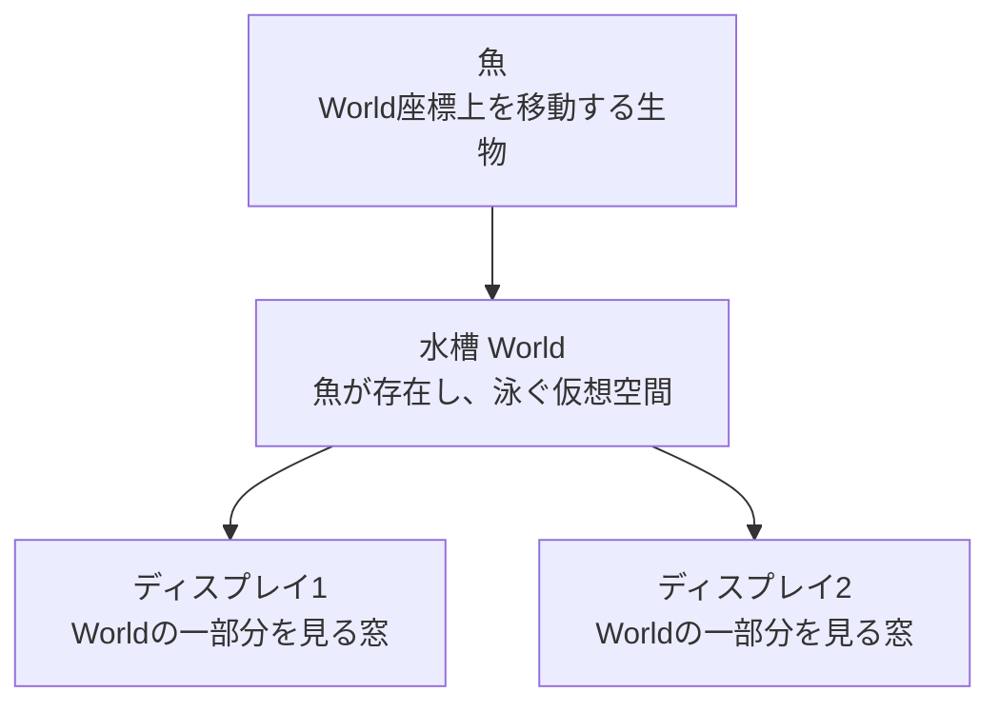

# おえかき水族館 概念設計・ディスプレイ調整・魚の泳ぎ方仕様

**基準日:** 2026-06-04  
**目的:** 水槽、ディスプレイ、魚の関係と、運用時の調整方法を明確にする  
**関連文書:** `CURRENT_SPECIFICATION.md`

---

## 1. このシステムを構成する3つの中心概念

おえかき水族館は、次の3つを別々の概念として扱う。

1. **水槽（World）**
2. **ディスプレイ（Display / Viewport）**
3. **魚（Fish）**

この3つを混同しないことが、システムを安定させるために最も重要である。



ディスプレイは水槽そのものではない。  
ディスプレイは水槽の一部分を映す「窓」である。

魚はディスプレイの中を泳いでいるのではない。  
魚は水槽全体の座標上を泳ぎ、その位置を含むディスプレイに映る。

---

## 2. 水槽の概念

### 2.1 水槽とは

水槽は、魚、背景、画像、障害物、放流位置などを配置するための仮想的な二次元空間である。

水槽は左上を原点 `(0, 0)` とする。

```text
(0, 0) --------------------------------------> X
  |
  |
  |
  |
  v
  Y
```

水槽は `width` と `height` を持つ。

```typescript
interface World {
  width: number;
  height: number;
}
```

魚や背景など、すべての配置物は水槽座標を使用する。

### 2.2 水槽サイズ

水槽サイズは、ディスプレイの物理解像度とは独立している。

例:

```text
水槽: 4000 x 1500

Display 1: 水槽の x=0   から x=1920 を表示
Display 2: 水槽の x=1920 から x=3840 を表示
Display 3: 水槽の x=3840 から x=4000 を表示
```

水槽サイズを変更しても、ディスプレイのブラウザ解像度は変わらない。

水槽サイズを変更すると変わるもの:

- 魚が泳げる全体範囲
- World背景の表示範囲
- 魚の水平wrap位置
- 魚の上下境界
- World座標を基準とする画像・禁止エリア・放流ポイント

水槽サイズを変更しても直接変わらないもの:

- ディスプレイの実際のピクセル数
- ディスプレイの担当Viewport
- 魚の画像ファイル
- 魚の大きさ設定値

### 2.3 水槽背景

水槽背景はWorld全体に貼られる画像である。

背景は各ディスプレイへ個別に貼るものではない。  
1枚の大きな画像をWorld全体へ貼り、各ディスプレイが担当範囲を切り取って表示する。

この方式により、複数ディスプレイをまたいで背景を連続させられる。

### 2.4 水槽内の領域

水槽には次の領域概念がある。

| 領域 | 意味 |
|---|---|
| World境界 | 水槽全体の外周 |
| Valid Zone | 接続ディスプレイが現在表示している範囲 |
| Forbidden Zone | 魚が侵入してはいけない範囲 |
| Spawn Point | 魚を放流する位置 |

#### World境界

魚の基本的な移動範囲を制限する。

- 上下端: 原則として跳ね返る
- 左右端: wrapまたはbounce

#### Valid Zone

ディスプレイが実際に映している範囲。

用途:

- ディスプレイの接続位置を表す
- Anchor魚の床位置を決める
- 放流ポイント未設定時の初期位置候補

現行実装では、通常魚はValid Zoneだけに制限されず、World全体を泳ぐ。

#### Forbidden Zone

柱、壁、映像を出したくない部分などを表現する。

魚がForbidden Zoneへ入ろうとした場合:

1. 最も近い辺を判定する
2. 魚を領域外へ押し戻す
3. 速度を反転・減衰する

#### Spawn Point

新しい魚が水槽へ現れる場所。

複数のSpawn Pointがある場合、放流時にランダムで選択される。

### 2.5 水槽に属する設定

以下は水槽全体の設定であり、特定のディスプレイや魚だけの設定ではない。

- World width / height
- 背景画像
- Forbidden Zones
- Spawn Points
- 画像レイヤー
- 魚レイヤー
- 水平境界モード
- 全魚速度倍率
- シーンオブジェクト

---

## 3. ディスプレイの概念

### 3.1 ディスプレイとは

ディスプレイは、水槽の一部分を表示する窓である。

ディスプレイは次の情報を持つ。

```typescript
interface Display {
  uuid: string;
  screenW: number;
  screenH: number;
  viewport: {
    x: number;
    y: number;
    width: number;
    height: number;
    scale: number;
  };
}
```

### 3.2 物理画面とViewportの違い

#### 物理画面

ブラウザが実際に描画する大きさ。

例:

```text
1920 x 1080 CSS pixels
```

#### Viewport

そのディスプレイが水槽のどの範囲を担当するか。

例:

```text
x=2000
y=100
width=1500
height=900
```

この場合、物理画面全体を使って、World内の `2000〜3500, 100〜1000` を表示する。

### 3.3 座標変換

魚のWorld座標をDisplay上の座標へ変換する。

```text
screenX = (fish.worldX - viewport.x) * scaleX
screenY = (fish.worldY - viewport.y) * scaleY

scaleX = physicalScreenWidth / viewport.width
scaleY = physicalScreenHeight / viewport.height
```

Viewportの幅を小さくすると、Worldの狭い範囲を画面全体へ表示するため、内容が大きく見える。

Viewportの幅を大きくすると、Worldの広い範囲を画面全体へ表示するため、内容が小さく見える。

### 3.4 ディスプレイの接続

Display Clientは起動時にサーバーへ接続し、自分のIDを登録する。

Display IDは次の順で決まる。

1. URLの `?id=`
2. ブラウザのlocalStorage
3. 自動生成ID

安定運用では、各ディスプレイへ固定IDを指定する。

例:

```text
/display?id=left
/display?id=center
/display?id=right
```

固定IDを使う理由:

- 再起動後も同じViewportへ復帰できる
- 管理画面で識別しやすい
- ディスプレイ交換時に設定を引き継ぎやすい

### 3.5 ディスプレイ番号

管理画面では、接続中のディスプレイをUUID順に並べ、1から番号を割り当てる。

番号は以下で一致させる。

- 管理画面の編集キャンバス中央
- DisplayのIdentifyパターン
- DisplayのCalibrationパターン

番号はディスプレイの永続IDではない。  
接続台数やUUID順が変わると番号も変わる可能性がある。

永続的な識別にはDisplay IDを使用する。

---

## 4. ディスプレイ配置の概念

### 4.1 配置とは

ディスプレイ配置とは、各ディスプレイがWorldのどこを表示するかを決めることである。

横に3台並べる例:

```text
World

┌──────────────┬──────────────┬──────────────┐
│  Display 1   │  Display 2   │  Display 3   │
│ x=0          │ x=1920       │ x=3840       │
│ y=0          │ y=0          │ y=0          │
│ w=1920       │ w=1920       │ w=1920       │
│ h=1080       │ h=1080       │ h=1080       │
└──────────────┴──────────────┴──────────────┘
```

上下にも配置できる。

```text
┌──────────────┐
│ Display 1    │
├──────────────┤
│ Display 2    │
└──────────────┘
```

斜め配置や一部重複もデータ上は可能である。

### 4.2 隣接

2つのディスプレイのViewport辺が一致していると、魚や背景が継ぎ目をまたいで連続表示される。

横方向の接続条件:

```text
左Display.x + 左Display.width = 右Display.x
```

縦方向の接続条件:

```text
上Display.y + 上Display.height = 下Display.y
```

### 4.3 重複

Viewportが重なる場合、重複領域内の魚や背景は両方のディスプレイへ表示される。

使用例:

- プロジェクターのエッジブレンディング
- 物理ベゼルを考慮した微調整

通常のモニター接続では、意図しない重複を避ける。

### 4.4 隙間

Viewport間に隙間がある場合、そのWorld座標はどのディスプレイにも映らない。

魚は現行実装では隙間を通過できるため、一時的にどの画面にも映らなくなる。

隙間を意図しない場合は、管理画面のスナップを使って辺を一致させる。

### 4.5 ベゼル

物理モニターの枠を映像上でも空白として扱う場合、Viewport間にベゼル相当の隙間を作る。

例:

```text
Display 1: x=0,    width=1920
Display 2: x=1960, width=1920

World上の40pxを物理ベゼルとして扱う
```

ただし、この場合は魚が40px分見えない時間が発生する。

ベゼルを無視して映像を連続させたい場合は隙間を作らない。

---

## 5. ディスプレイ調整仕様

### 5.1 調整の目的

ディスプレイ調整では次を合わせる。

- 各画面の識別
- 画面の左右上下関係
- 背景や魚の継ぎ目
- 表示倍率
- 物理画面とWorld座標のアスペクト比
- 必要に応じたベゼルや重複

### 5.2 調整前の準備

1. サーバーを起動する
2. 管理画面 `/manage` を開く
3. 各Displayを固定ID付きで開く
4. 各Displayをフルスクリーンにする
5. 管理画面で全Displayが接続中になっていることを確認する
6. Displayごとのブラウザズームを100%にする

推奨ID:

```text
left
center
right
top-left
top-right
```

### 5.3 Identifyによる画面識別

管理画面からIdentifyを送信する。

Display中央に大きな番号が表示される。

確認事項:

- 管理画面の番号と実画面の番号が一致する
- 同じIDを複数Displayが使用していない
- 想定していないDisplayが接続していない

### 5.4 World Mapによる大まかな配置

World Mapパターンでは、各DisplayへWorld座標グリッドを表示する。

使用目的:

- Displayの担当位置確認
- 左右上下の取り違え確認
- 大きなズレの修正
- World原点の確認

調整:

1. 管理画面でDisplayを選択する
2. Display矩形をドラッグする
3. 実画面の座標グリッドを確認する
4. 隣接Displayの座標が連続する位置へ配置する

### 5.5 Grid / Crosshairによる細部調整

Grid:

- 画面端の一致
- スケール差
- 水平・垂直のズレ

Crosshair:

- 画面中央
- 四隅
- クロップやオーバースキャン

### 5.6 Calibrationによる詳細確認

Calibrationは以下を表示する。

- Display番号
- Display ID
- Viewport位置
- Viewportサイズ
- scale
- 中央線
- 外周

調整後の最終確認に使用する。

### 5.7 管理画面でのドラッグ仕様

レイヤー未選択時、キャンバス上ではDisplayだけを操作する。

#### Display本体ドラッグ

- Display矩形内をドラッグすると位置を変更
- 幅と高さは維持
- ドラッグ開始時に対象を固定
- ドラッグ中は対象DisplayだけへViewport Previewを送る
- ドラッグ中も魚の物理演算と描画を継続
- ドラッグ終了時にViewportを永続保存

#### Displayリサイズ

選択したDisplayの8方向ハンドルをドラッグする。

- 四隅: 幅と高さを変更
- 上下: 高さを変更
- 左右: 幅を変更
- AR固定ON時: 元アスペクト比を維持
- 最小サイズ: 幅100、高さ100

#### スナップ

Displayを移動・リサイズするとき、近くの辺や中心へ吸着する。

対象:

- 他Displayの左・右・中央X
- 他Displayの上・下・中央Y
- Worldの外周

### 5.8 数値入力による調整

Sidebarから以下を直接入力できる。

- X
- Y
- Width
- Height

ドラッグよりも正確な値が必要な場合に使用する。

### 5.9 微調整

選択Displayは矢印キーで移動できる。

| 操作 | 移動量 |
|---|---:|
| 矢印キー | 1px |
| Shift + 矢印キー | 10px |

### 5.10 調整中に変えてはいけないもの

Display調整中に以下は動かさない。

- 魚
- 画像レイヤー
- Forbidden Zone
- Spawn Point
- Worldサイズ
- 他のDisplay

Display調整モードでは、クリック・ドラッグの対象をDisplayだけに限定する。

### 5.11 調整完了条件

以下をすべて満たしたら調整完了とする。

- 各Displayの番号とIDが確認できる
- 左右上下の並びが正しい
- World Map座標が隣接画面で連続する
- Gridの線が継ぎ目で一致する
- 背景画像が自然につながる
- 魚が画面間を移動しても大きさや速度が急変しない
- 再起動後も同じ配置へ復帰する

---

## 6. ディスプレイ接続と状態管理

### 6.1 接続状態

現行の主な状態:

| 状態 | 意味 |
|---|---|
| Connected | WebSocket接続中 |
| Disconnected Grace | 切断後10秒以内。管理画面に履歴表示 |
| Removed | 切断後10秒を超え一覧から削除 |

将来的には次の状態を区別するべきである。

- Connected
- Degraded
- Sleeping
- Stale
- Disconnected

### 6.2 Heartbeat

- クライアントは10秒ごとにheartbeatを送る
- サーバーは全メッセージ受信時に最終通信時刻を更新する
- 120秒通信がなければ切断する
- 管理画面へ5秒ごとに状態を通知する

### 6.3 スリープ復帰

Displayは以下を行う。

- Screen Wake Lockを要求
- 表示状態へ戻ったときWake Lockを再取得
- WebSocketが切断していれば再接続
- 表示中にサーバーメッセージが30秒以上届かなければ接続を作り直す

### 6.4 Frame送信詰まり

Displayがスリープ・低速状態のとき、古い魚位置を大量に送る意味はない。

サーバーは送信キューが一定量を超えたDisplayに対して、古いframeの追加送信を止める。

復帰後は最新frameから描画を再開する。

---

## 7. 魚の概念

### 7.1 魚とは

魚は、画像と設定と物理状態を持ち、World上を移動するオブジェクトである。

魚は特定のDisplayには所属しない。

魚がDisplayのViewportへ入ると、そのDisplayに表示される。

### 7.2 魚を構成する情報

#### 画像

- 透過PNG
- サーバー上のURL
- 表示時にPixiJS Textureへ変換

#### ユーザー設定

- 動きタイプ
- 大きさ
- 速さ
- 回転補正
- 泳ぐ方向
- 手書きモーションパス
- ピン留めレイヤー

#### 物理状態

- 現在位置
- 現在速度
- レイヤー速度倍率

#### 表示状態

- 所属レイヤー
- 目標スケール
- 目標透明度
- Z-Index
- 左右反転方向
- 回転角

### 7.3 魚の管理状態

| 状態 | 意味 |
|---|---|
| Pending | 画像取込後、未放流 |
| Locked | Controllerで編集中 |
| Active | 水槽内で泳いでいる |
| Archived | 保存されているが描画・物理演算対象外 |
| Deleted | 削除済み |

### 7.4 魚の管理操作

管理画面では以下を操作できる。

- 動きタイプ変更
- 大きさ変更
- 速さ変更
- 泳ぐ方向変更
- 位置移動
- 複製
- ピン留め
- レイヤー指定
- アーカイブ
- 削除
- 全魚の大きさ倍率変更
- 全魚の速度倍率変更
- 全魚の再配置

### 7.5 大きさ

魚の最終表示サイズは、ユーザー設定と魚レイヤーの積で決まる。

```text
targetScale = userParams.scale × layer.scale
```

例:

```text
魚 scale = 1.5
遠景 layer scale = 0.4

targetScale = 0.6
```

Displayでは元画像のピクセルサイズにかかわらず、基準サイズへ正規化して表示する。

### 7.6 速さ

魚の移動倍率は以下で決まる。

```text
魚のspeed
× 魚レイヤーのspeedFactor
× 水槽全体のfishSpeedMultiplier
```

このため、同じ魚でも遠景へ移動すると遅く見える。

### 7.7 レイヤー

魚レイヤーは奥行きを表現する。

| レイヤー | 見え方 | 動き |
|---|---|---|
| 前景 | 大きい、濃い | 速い |
| 中景 | 少し小さい、少し薄い | 少し遅い |
| 遠景 | 小さい、薄い | 遅い |

新しい魚ほど前景へ配置され、古い魚ほど奥へ送られる。

ピン留めされた魚は指定レイヤーへ固定される。

### 7.8 アーカイブ

アーカイブされた魚:

- 画像ファイルと設定は残る
- Active Poolには残る
- 物理演算しない
- frameへ含めない
- Displayへ表示しない

---

## 8. 魚の泳ぎ方の共通仕様

### 8.1 サーバー主導

魚の位置はDisplay側で計算しない。

サーバーが約60fpsで次を行う。

1. 魚タイプ別の移動計算
2. 境界処理
3. エサへの反応
4. 位置・速度更新
5. 向き・傾き計算
6. Displayへframe配信

これにより、すべてのDisplayで同じ魚が同じ位置に見える。

### 8.2 表示補間

Displayはサーバー座標をそのまま瞬間移動させず、目標値へ補間する。

目的:

- 通信間隔の揺れを吸収
- 画面間移動を滑らかにする
- レイヤー変更時の大きさ・透明度変化を滑らかにする

### 8.3 左右の向き

魚の進行方向はX速度から判定する。

- X速度が正: 右向き
- X速度が負: 左向き
- X速度が小さい: 前回方向を維持
- directionが指定済み: 指定方向を優先

Displayでは画像を左右反転して向きを表現する。

### 8.4 傾き

Y速度を使って、魚が上昇・下降するときに少し傾ける。

傾きは水平速度に対して抑制され、上下へ大きく回転しすぎない。

### 8.5 境界

すべての移動魚はWorld境界とForbidden Zoneの影響を受ける。

Anchorは固定型なので通常境界処理を行わない。

### 8.6 エサへの反応

エサの近くにいる魚は、エサ方向へ速度を加算される。

- 有効半径: 400px
- 寿命: 5秒
- 距離が近いほど強く引かれる

魚タイプ固有の動きは維持され、その上へエサの引力が加わる。

---

## 9. 魚タイプ別の泳ぎ方

### 9.1 Tuna / マグロ

**目的:** 速く、力強く、ほぼ水平に泳ぐ魚。

特徴:

- 高速な水平移動
- 個体ごとに速度差がある
- 左右どちらかへ泳ぐ
- 一定時間ごとに別のYレーンへ移動
- Y方向には小さなサイン波ドリフト
- bounceモードでは左右端で方向転換
- wrapモードでは反対側へ回り込む
- Forbidden Zone手前で方向転換

見え方:

- 常に進み続ける
- 大きく上下しすぎない
- 複数匹が同じ速度・同じ高さにならない

向いている魚:

- マグロ
- カツオ
- 細長い高速魚

### 9.2 School / イワシ群れ

**目的:** 複数の魚が緩やかな群れを作りながら、World全体へ広がる。

基本ルール:

1. **Separation**  
   近すぎる魚から離れる。

2. **Alignment**  
   近くの魚と進行方向を合わせる。

3. **Cohesion**  
   近くの魚の中心へ近づく。

追加仕様:

- IDから小さなグループへ分割
- グループごとに巡航方向を持つ
- 一定時間ごとにYターゲットを変更
- World高さの約8%から92%を移動対象とする
- Wanderにより不規則な方向変化を加える
- 中央へ全魚が密集し続けないようにする

見え方:

- 同じ方向へ泳ぐ魚がいる
- 完全に一塊にはならない
- 縦方向にも散らばる
- 時間とともに群れの形が変わる

向いている魚:

- イワシ
- 小魚
- 群れで泳ぐ魚

### 9.3 Squid / イカ

**目的:** 停止と噴射を繰り返す、イカらしい動き。

特徴:

- 巡航速度とパルス速度を持つ
- 一定時間休んだ後、短時間だけ高速移動
- X速度は滑らかに変化
- Y方向はサイン波でホバリング
- 個体ごとに位相とサイクル開始位置が異なる
- bounceモードでは左右端で方向転換

見え方:

- ゆっくり漂う
- ときどき勢いよく進む
- 上下へふわふわ移動する

向いている魚:

- イカ
- エビ
- パルス移動する生物

### 9.4 Jellyfish / クラゲ

**目的:** 水流に流されながら、大きくゆっくり上下する。

特徴:

- X方向は低速の一定ドリフト
- Y方向は大きなサイン波
- 個体ごとに開始位相が異なる
- 上下移動の中心位置を持つ
- 管理画面で移動した場合は新しいY位置を中心にする

見え方:

- 非常にゆっくり
- 大きく上下する
- 水中を漂っているように見える

向いている魚:

- クラゲ
- 風船型の生物
- 漂うもの

### 9.5 Shark / サメ

**目的:** 単独で大きな弧を描く、存在感のある回遊。

特徴:

- 個体ごとに進行角度と旋回率を持つ
- 長時間かけて旋回方向が変わる
- Y速度はX速度より抑制
- 壁付近ではWorld中央方向へ角度を修正
- 他魚との群れ計算を行わない

見え方:

- 大きなカーブで泳ぐ
- 急に方向転換しない
- 単独行動する

向いている魚:

- サメ
- エイ
- 大型魚

### 9.6 Anchor / 固定

**目的:** 海底や床へ固定される生物・オブジェクト。

特徴:

- 初回に最寄りDisplayの床Yを取得
- X位置を固定
- Y位置を床へ固定
- 通常移動しない
- 手書きパスがある場合、そのパスを揺れとして再生
- 手書きパスがない場合、小さなサイン波で左右へ揺れる

見え方:

- 位置は変わらない
- 少しだけ揺れる

向いているもの:

- チンアナゴ
- 海草
- サンゴ
- 岩

### 9.7 Looper / 手書きループ

**目的:** ユーザーが描いたモーションパスを繰り返す旧互換動作。

特徴:

- World上をゆっくり横移動
- 手書きパスをローカルな上下・左右移動として再生
- パスがない場合は右へ流れる
- Wanderを追加

注意:

現行実装は手書きパスを完全な親子座標として管理せず、移動量を直接位置へ加算している。長時間動作時に意図より大きく移動する可能性がある。

### 9.8 Swimmer / 旧自由遊泳

`school` と同じ処理を使う互換タイプ。

新規登録では原則として `school` を使用する。

---

## 10. 魚の縦方向移動

### 10.1 縦方向へ散らばる仕組み

魚が縦方向へ散らばるためには、魚タイプごとに異なるY移動要因を持つ。

| Type | Y方向の要因 |
|---|---|
| tuna | レーンターゲット + 小さなサイン波 |
| school | グループのYターゲット + Boids + Wander |
| squid | 基準Yを中心とするサイン波 |
| jellyfish | 基準Yを中心とする大きなサイン波 |
| shark | 旋回角度のY成分 |
| looper | 手書きパス + Wander |
| anchor | 床固定 + 揺れ |

### 10.2 縦方向へ散らばらない原因

設計上起こり得る原因:

- 全魚の初期位置が同じ
- Yターゲット範囲が狭い
- Y速度を強く減衰しすぎる
- Cohesionが強すぎて同じ高さへ集まる
- 境界マージンが大きすぎる
- World高さが小さい
- 魚のspeedが0に近い
- 魚タイプがAnchor
- 管理画面移動後に内部基準Yが古い位置のまま

### 10.3 望ましい縦分布

すべての魚を均一に散らす必要はない。

望ましい状態:

- マグロは複数の水平レーンへ分かれる
- 群れ魚はグループ単位で異なる高さを泳ぐ
- クラゲとイカは上下移動が目立つ
- サメは大きな弧で上下する
- Anchorは床へ集まる

魚の種類ごとの性質が見える分布を優先する。

---

## 11. 魚の位置調整仕様

### 11.1 管理画面からの移動

魚レイヤーを選択した状態で魚をドラッグする。

ドラッグ中:

- 管理画面上では魚をポインターへ追従させる
- 他の魚やDisplayは動かさない

ドラッグ終了時:

- サーバーへ新しい位置を送る
- 魚の速度を一度0へする
- 魚タイプ固有の基準位置を更新する
- 次の物理フレームから泳ぎを再開する

### 11.2 位置調整中も魚を止めない

DisplayのViewport調整と魚の物理演算は別の責務である。

Display調整中に魚を停止してはいけない理由:

- 実際の運用状態で画面間移動を確認できない
- 継ぎ目の調整が難しくなる
- 来場者には停止が不具合に見える
- Display配置と魚物理を不必要に結合することになる

したがって、Viewport Preview中もゲームループと魚frame配信を継続する。

---

## 12. 操作責務の分離

管理画面では、1回のドラッグが複数種類の対象へ影響してはいけない。

### Display操作

変更可能:

- Displayのx、y、width、height、scale

変更禁止:

- 魚位置
- 画像位置
- Worldサイズ
- Forbidden Zone
- Spawn Point
- 他Display

### Fish操作

変更可能:

- 選択魚の位置

変更禁止:

- Display
- 画像
- World設定
- 他魚

### Image操作

変更可能:

- 選択画像レイヤーの位置と大きさ

変更禁止:

- Display
- 魚
- Systemオブジェクト

### System操作

変更可能:

- Forbidden Zone
- Spawn Point

変更禁止:

- Display
- 魚
- 画像

---

## 13. 推奨運用フロー

### 展示開始前

1. サーバー起動
2. 各Display起動
3. 管理画面で接続確認
4. Identifyで画面番号確認
5. World Mapで位置確認
6. Gridで継ぎ目確認
7. 通常描画へ戻す
8. 魚が画面間を移動することを確認
9. Controllerからテスト魚を放流
10. Guestからエサを投入して反応確認

### 展示中

- Display配置は原則変更しない
- Displayブラウザを操作しない
- 管理画面はView OnlyまたはFish管理中心にする
- 接続状態と魚数を定期確認する
- Pending魚を承認・拒否する

### 展示終了後

- 必要な魚をアーカイブ
- 不要なPendingを削除
- Display接続状態を確認
- `data/aquarium-settings.json` と `data/fish` をバックアップ

---

## 14. 設計上の原則

1. **Worldを唯一の座標系とする**  
   Displayごとの独自魚座標を持たない。

2. **Displayは見る範囲だけを持つ**  
   Display移動で魚や背景そのものを動かさない。

3. **魚の物理演算はサーバーで一元管理する**  
   Displayごとに魚の位置を計算しない。

4. **調整中も通常状態を維持する**  
   Viewport調整中に魚を停止しない。

5. **操作対象を明示的に分離する**  
   1回のドラッグで複数種類のオブジェクトを変更しない。

6. **魚タイプの性質を優先する**  
   すべての魚を同じ動きにしない。

7. **接続復帰は最新状態から行う**  
   古いframeを順番に再生しない。

8. **永続IDと表示番号を区別する**  
   Display IDは固定、番号は一時的な識別表示。

9. **運用中の誤操作を防ぐ**  
   Display自身のドラッグや管理設定変更はロック可能にする。

10. **設定と現在状態を分ける**  
    魚のspeedやtypeは設定、posやvelは現在状態として扱う。

