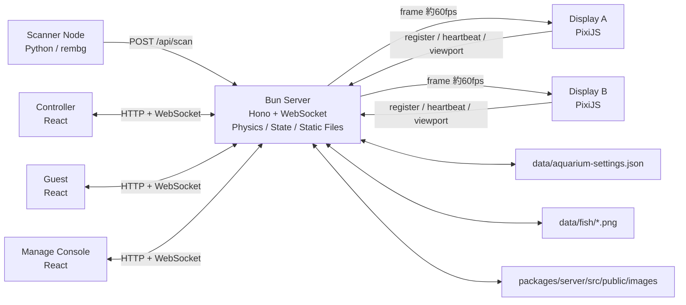
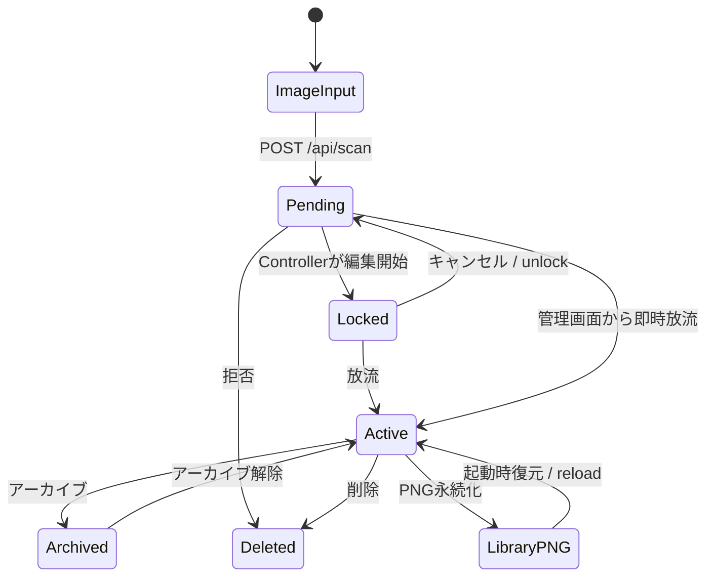

# おえかき水族館 現行実装仕様書

**文書種別:** 現行コード基準の総合仕様  
**基準日:** 2026-06-04  
**対象リポジトリ:** `oekaki_aquarium`  
**正本:** 本文書と実装コード。旧 `SPECIFICATION.md` は初期構想資料として扱う。  

---

## 1. システム概要

おえかき水族館は、紙や端末で描いた魚の画像を取り込み、複数のブラウザディスプレイを一つの仮想水槽として連結して表示するシステムである。

サーバーが魚の位置、速度、レイヤー、遊泳ロジックを一元管理し、約60fpsで各表示クライアントへ座標をWebSocket配信する。表示クライアントは自分に割り当てられたViewport範囲だけをPixiJSで描画する。

主な利用者は以下の4種類である。

| 利用者 | 画面 | 主な用途 |
|---|---|---|
| 運用管理者 | `/manage` | モニター配置、魚管理、背景・レイヤー・水槽設定 |
| 展示ディスプレイ | `/display` | 仮想水槽の一部分を描画 |
| 魚の登録担当者 | `/controller` | 撮影・承認待ち魚の選択、パラメーター調整、放流 |
| 来場者 | `/guest` | エサやり、魚画像の登録・放流 |

---

## 2. 現行アーキテクチャ

### 2.1 構成



### 2.2 技術スタック

| 領域 | 技術 |
|---|---|
| Runtime / Server | Bun |
| HTTP API | Hono |
| Realtime通信 | Bun native WebSocket |
| Frontend | React 18、TypeScript、Vite MPA |
| Display描画 | PixiJS 8 |
| 管理画面UI | React、Tailwind CSS、Radix UI、lucide-react |
| 状態共有型 | `@aquarium/shared` workspace package |
| 画像処理 | Sharp、Python rembg、Pillow |
| 永続化 | JSONファイル、PNGファイル、PNG tEXtメタデータ |

### 2.3 通信ポート

現行実装はHTTP、WebSocket、静的ファイルをすべて同一ポートで提供する。

| ポート | 用途 |
|---|---|
| `3000` | 本番HTTP、API、WebSocket `/ws`、画像、ビルド済み画面 |
| `5173` | Vite開発サーバー。APIとWebSocketを3000番へプロキシ |

`PORTS.WS = 8080` と `PORTS.UDP = 41234` は共有定数に残っているが、現行実装では使用していない。

---

## 3. アプリケーション画面

### 3.1 ポータル `/`

各画面へのリンクを表示する入口画面。

- Manage Console
- Display Client
- Guest App
- Controller

認証や権限分離はない。

### 3.2 管理画面 `/manage`

管理画面は以下の3タブを持つ。

#### Layoutタブ

仮想水槽とディスプレイ配置を編集する。

主な機能:

- 接続ディスプレイ一覧表示
- ディスプレイViewportのドラッグ移動・リサイズ
- ViewportのX、Y、幅、高さの数値編集
- ディスプレイ番号を編集キャンバス中央へ大きく表示
- AR固定リサイズ
- ドラッグ中の対象ディスプレイへのリアルタイムプレビュー
- 他ディスプレイ、World境界へのスナップ
- Worldサイズ変更
- 背景画像設定
- 画像レイヤー追加、配置、リサイズ、透明度、表示状態、Z順変更
- 侵入禁止エリア追加・移動・リサイズ
- 放流ポイント追加・移動
- 魚の管理キャンバス表示
- 魚位置のドラッグ移動
- テストパターン送信
- 水平方向境界モード変更
- 全魚速度倍率変更

操作対象は明示的に分離される。

- レイヤー未選択: ディスプレイ操作
- `layer_system` 選択: 禁止エリア・放流ポイント操作
- 画像レイヤー選択: 対象画像レイヤー操作
- 魚レイヤー選択: 対象魚操作

ディスプレイドラッグ時はpointer captureを使用し、途中で別オブジェクトへ操作対象が移らない。

#### Fish Dataタブ

アクティブな魚と魚ライブラリを管理する。

主な機能:

- アクティブ魚一覧
- 魚ごとの動きタイプ変更
- スケール変更
- 速度変更
- 泳ぐ方向変更
- レイヤーピン留め
- アーカイブ
- 複製
- 削除
- 全魚のスケール・速度一括倍率変更
- World全体への魚再配置
- PNGライブラリ再読み込み
- ギャラリー画像から魚を追加・放流

#### Pendingタブ

承認待ち魚を管理する簡易画面。

- PNGアップロード
- デフォルト設定で即時放流
- 拒否・削除

Controllerの詳細編集とは別の運用者向け簡易操作である。

### 3.3 Display Client `/display`

展示モニターで動作する描画クライアント。

#### Display ID

Display IDは次の優先順位で決定する。

1. URLクエリ `?id=...`
2. `localStorage["display-id"]`
3. ランダム生成した `disp-xxxxxx`

WebSocket登録UUIDは `display:<DISPLAY_ID>` となる。IDが同じであれば再接続後も保存済みViewportを復元する。

#### 描画内容

- World背景
- 画像レイヤー
- シーンオブジェクト
- 魚レイヤー
- テストパターン
- 管理画面のレーザーポインター

#### Viewport座標変換

```text
screenX = (worldX - viewport.x) * scaleX
screenY = (worldY - viewport.y) * scaleY

scaleX = window.innerWidth  / viewport.width
scaleY = window.innerHeight / viewport.height
```

Viewport外から200px以内の魚は、画面間移動を滑らかにするため先読み描画対象に含める。

#### クライアント補間

サーバーから受けた目標値へPixiJS tickerで補間する。

| 値 | 補間係数 |
|---|---|
| X / Y | `0.12` |
| 回転 | `0.08` |
| スケール | `0.05` |
| 透明度 | `0.05` |

#### テクスチャ読み込み

- 同一URLの同時ロードを統合
- 最大同時ロード数6
- 8秒タイムアウト
- 指数バックオフ再試行
- PixiJS失敗キャッシュ回避用に再試行クエリを付与
- 読み込み中はプレースホルダーを表示
- サーバーは魚画像へ長期HTTPキャッシュを付与

#### スリープ・通信対策

- Screen Wake Lock APIを要求
- `visibilitychange` でWake Lock再取得
- WebSocket自動再接続
- 10秒ごとのheartbeat
- 表示中に30秒以上サーバーメッセージがない場合は接続を再確立
- サーバー側heartbeatタイムアウトは120秒
- WebSocket送信キューが512KBを超えたクライアントには古いframeを追加送信しない

#### Display自身によるViewport移動

DisplayキャンバスをドラッグするとローカルViewportが移動し、ドラッグ終了時にサーバーへ保存する。

ただし、この機能は展示運用中の誤操作リスクがあるため、将来的には管理モード時のみ有効にすることを推奨する。

### 3.4 Controller `/controller`

魚の承認待ちキューを編集し、放流する画面。

#### Gallery

- `/api/pending` を3秒ごとに取得
- `fish_added` WebSocketイベントでも更新
- カメラ撮影または画像選択
- 画像をController向け自動処理付きで `/api/scan` へ送信
- 編集開始時に排他ロックを取得
- 他端末がロック中の魚は編集不可

#### Controller画像前処理

Controllerからアップロードされた画像にはサーバー側で以下を適用する。

1. EXIF方向を考慮した自動回転
2. 長辺1600px以内へ縮小
3. 明るく低彩度な用紙背景を透明化
4. 透明余白をトリミング
5. 長辺1024px以内へ正規化
6. PNGとして保存

現行処理は白い用紙背景を前提とする。四隅指定による台形補正は未実装。

#### Editor

- 魚画像プレビュー
- 泳ぐ方向: `auto` / `left` / `right`
- 回転補正: -180度から180度
- 動きタイプ選択
- 大きさ: 0.3から3.0
- 速さ: 0.2から3.0
- `looper` / `anchor` 向け手書きモーションパス
- 設定入りPNGダウンロード
- 放流
- キャンセル時の排他ロック解除

放流後はGuest画面へのQRコードを表示する。

### 3.5 Guest `/guest`

来場者向け画面。2モードを持つ。

#### エサやりモード

- 画面タップ位置をワールド座標に変換
- WebSocket `spawn_food` を送信
- タップ回数とリップル演出を表示
- 接続状態を表示

現行の座標変換は `3840 x 1080` 固定値であり、実際のWorldサイズ変更には追従しない。

#### 魚作成モード

- カメラ撮影または画像選択
- `/api/scan` へアップロード
- Controllerと同じEditorでパラメーター設定・放流

Guestからの画像アップロードには、現時点ではController用の `autoProcess=true` が付かない。

### 3.6 Scanner Node

Pythonスクリプトが指定フォルダを監視する。

処理:

1. `scanner/input` を監視
2. 新規画像を検出
3. rembgで背景除去
4. 長辺1024px以内へ縮小
5. `scanner/output` へPNG保存
6. `/api/scan` へアップロード

環境変数:

| 変数 | デフォルト |
|---|---|
| `SERVER_URL` | `http://localhost:3000` |
| `INPUT_DIR` | `scanner/input` |
| `OUTPUT_DIR` | `scanner/output` |

---

## 4. 仮想水槽とディスプレイ

### 4.1 World

Worldは魚が移動するグローバル座標空間である。

デフォルト値:

```json
{
  "width": 1080,
  "height": 1440
}
```

Worldは接続ディスプレイの大きさとは独立しており、管理画面から変更できる。

### 4.2 Viewport

各DisplayはWorldの一部分を担当する。

```typescript
interface Viewport {
  x: number;
  y: number;
  width: number;
  height: number;
  scale: number;
}
```

初回接続時は、Displayのブラウザアスペクト比を維持しつつWorld内に収まる最大Viewportを中央配置する。

### 4.3 Valid Zone

接続済みDisplayのViewportは `validZones` として登録される。

Valid Zoneは以下で使用される。

- Anchor魚の床位置決定
- 放流ポイント未設定時の初期スポーン位置
- 将来の画面外判定用ユーティリティ

現行の通常魚境界処理はValid Zoneの連結形状ではなく、World全体矩形を境界として使用する。モニター間に空白がある場合でも、魚はその空白座標を通過できる。

### 4.4 Forbidden Zone

管理画面で指定する進入禁止矩形。

魚が領域付近へ侵入すると、最も近い辺の外へ座標補正し、速度を反転・減衰させる。

### 4.5 Spawn Point

魚の放流位置。

- 複数存在する場合はランダム選択
- 選択位置へX/Y各±20pxのばらつきを追加
- 未設定時は先頭Valid Zone左側中央付近
- Valid Zoneもない場合は `(200, 400)`

### 4.6 水平境界モード

| モード | 動作 |
|---|---|
| `wrap` | 左右端を越えると反対側へ移動 |
| `bounce` | 左右端で反射 |

上下端は常に反射・クランプされる。

---

## 5. 魚のライフサイクル



### 5.1 PendingFish

承認待ち状態。

```typescript
interface PendingFish {
  id: string;
  imageUrl: string;
  timestamp: number;
  lockedBy?: string;
  fishMeta?: FishMeta;
}
```

Pendingキューはメモリ上のみであり、サーバー再起動時に失われる。画像ファイル自体は残る。

### 5.2 FishConfig

放流時に必要な設定。

```typescript
interface FishConfig {
  id: string;
  type: FishType;
  textureUrl: string;
  author?: string;
  fishMeta?: FishMeta;
  userParams: {
    scale: number;
    speed: number;
    rotationOffset: number;
    direction?: "auto" | "left" | "right";
  };
  motionPath?: Vector2[];
  isPinned?: boolean;
  pinnedLayerId?: number;
}
```

### 5.3 ActiveFish

放流済み状態。FishConfigに物理状態とレイヤー状態を加える。

- `timestamp`: 放流時刻
- `physics.pos`: 現在位置
- `physics.vel`: 現在速度
- `physics.speedMultiplier`: レイヤー速度倍率
- `layerIndex`: 現在レイヤー
- `targetScale`: 表示目標スケール
- `targetOpacity`: 表示目標透明度
- `isArchived`: 非表示・物理演算除外

### 5.4 放流処理

1. Pendingキューから対象を除去
2. FishType別の初期速度を設定
3. Active Poolへ登録
4. レイヤーを再計算
5. PNGへFishMetaを書き込み `data/fish/<id>.png` へ保存
6. `textureUrl` を `/lib-images/<id>.png` へ差し替え
7. `fish_released` をブロードキャスト

---

## 6. 魚の動き

### 6.1 共通速度倍率

最終的な移動倍率は概ね以下の積で決まる。

```text
レイヤー speedFactor
× 魚 userParams.speed
× World fishSpeedMultiplier
```

### 6.2 動きタイプ

| Type | 現行動作 |
|---|---|
| `tuna` | 高速な水平移動。個体別速度差。一定時間ごとにYレーンを変更 |
| `school` | 小群単位のBoids。分離・整列・結合、横巡航、広いYターゲット |
| `squid` | 休止とパルス推進を繰り返し、Y方向へサイン波ホバリング |
| `jellyfish` | ゆっくり横流れし、Y方向へ大きく上下浮遊 |
| `shark` | 個体ごとの旋回率で大きな弧を描く単独回遊 |
| `anchor` | Xを固定し、最寄り床Yへ固定。手書きパスまたはサイン波で揺れる |
| `looper` | 横方向の潮流と手書きローカルパスを組み合わせる旧互換タイプ |
| `swimmer` | `school` と同じ処理を使う旧互換タイプ |

### 6.3 方向指定

`direction` が `left` または `right` の場合、魚種の計算後にX移動方向を強制する。

Displayでは進行方向を画像の左右反転で表現し、Y速度から緩い傾きを算出する。

### 6.4 Wander

`school`、`swimmer`、`looper` には共通Wanderが追加される。

- 個体ごとに目標角度を持つ
- 不規則な間隔で目標角度を変更
- 壁・禁止エリア付近で反発
- Y方向にもドリフトを追加

### 6.5 境界とエサ

全移動魚へ以下を適用する。

- World左右端: wrapまたはbounce
- World上下端: bounce
- Forbidden Zone衝突補正
- 魚種別最大速度クランプ
- エサへの引力

エサの寿命は5秒。引力半径は400px。

### 6.6 管理画面からの位置移動

管理画面で魚をドラッグすると `/api/fish/:id/position` を呼ぶ。

- 座標を即時変更
- 速度を0へリセット
- tuna、squid、jellyfishの内部基準Yを新位置へ合わせる

物理演算自体は停止せず、次フレームから新位置を基準に移動を継続する。

---

## 7. レイヤー仕様

### 7.1 魚レイヤー

| Layer | 最大数 | Scale | Opacity | Speed | Z |
|---|---:|---:|---:|---:|---:|
| 0 前景 | 10 | 1.0 | 1.0 | 1.0 | 100 |
| 1 中景 | 20 | 0.7 | 0.8 | 0.6 | 50 |
| 2 遠景 | 50 | 0.4 | 0.4 | 0.3 | 10 |

一般魚は新しい順に前景から割り当てる。最終レイヤーの定員を超えた魚は最終レイヤーへ追加され続ける。

ピン留め魚は定員を無視して指定レイヤーへ配置される。

レイヤー再計算は約10フレームごと、および魚の追加・更新時に行う。

### 7.2 アプリケーションレイヤー

管理画面とDisplayで共有するレイヤー。

```typescript
interface AppLayerConfig {
  id: string;
  name: string;
  type: "image" | "fish" | "foreground";
  url?: string;
  x?: number;
  y?: number;
  width?: number;
  height?: number;
  zIndex: number;
  visible: boolean;
  opacity: number;
  aspectRatioLocked?: boolean;
}
```

画像レイヤーはWorld座標で位置・大きさを持ち、各DisplayのViewportへ変換して描画する。

### 7.3 シーンオブジェクト

別系統で `WorldObject` のCRUD APIを持つ。

対応型:

- image
- rect
- ellipse
- text

Display実装では現在、image、rect、ellipseを描画する。text描画は未実装。

---

## 8. リアルタイム通信

### 8.1 接続登録

全クライアントは接続直後に `register` を送る。

```json
{
  "event": "register",
  "uuid": "display:main",
  "hardware": { "w": 1920, "h": 1080 }
}
```

UUID prefixからクライアント種別を判定する。

- `display`
- `manage`
- `controller`
- `guest`
- `unknown`

### 8.2 Heartbeat

- クライアントは10秒ごとに送信
- サーバーは全受信メッセージを生存確認として扱う
- 120秒受信がなければ切断
- 管理画面へ5秒ごとに状態をpush
- 切断Displayは10秒間、切断状態として管理画面一覧へ残す

### 8.3 Frame

サーバーゲームループは16ms間隔で実行し、DisplayとManageへ `frame` を送る。

```json
{
  "event": "frame",
  "t": 1770000000000,
  "f": [
    {
      "i": "short-id",
      "x": 500,
      "y": 300,
      "r": 0.1,
      "s": 1,
      "o": 1,
      "z": 100,
      "l": 0,
      "u": "/lib-images/id.png",
      "d": 1,
      "vx": 2.5
    }
  ],
  "e": []
}
```

魚IDは先頭8文字へ短縮される。

### 8.4 Viewport Preview

管理画面のディスプレイドラッグ中は、対象Displayのみに仮Viewportを送る。

このプレビューは永続化しない。ドラッグ終了時にHTTP APIで確定保存する。

プレビュー中も魚フレームは継続描画する。

### 8.5 主なイベント

#### ClientからServer

- `register`
- `heartbeat`
- `spawn_food`
- `viewport_preview`
- `update_viewport`
- `pointer_move`
- `update_world_config`
- `update_world_size`  
  現行実装で使用するが共有型のunionには未定義で、管理画面側で型抑制している。

#### ServerからClient

- `config`
- `frame`
- `state_push`
- `client_list`
- `fish_list`
- `fish_added`
- `fish_locked`
- `fish_released`
- `test_pattern`
- `update_viewport`
- `viewport_preview`
- `pointer_move`
- `update_world_config`
- `update_world_size`
- `scene_update`
- `reload`

---

## 9. テストパターン

| Pattern | 用途 |
|---|---|
| `off` | 通常描画 |
| `identify` | 背景を維持したまま中央へ大きな番号を表示 |
| `gradient` | 色・階調確認 |
| `grid` | 格子・端確認 |
| `colorbars` | カラーバー |
| `white` | 全面白 |
| `black` | 全面黒 |
| `crosshair` | 中央・四隅確認 |
| `worldmap` | World座標グリッドとミニマップ |
| `calibration` | 番号、ID、Viewport情報を含む全面調整画面 |

`off` 以外のテストパターン表示中、Displayは魚frameを処理しない。

---

## 10. HTTP API

### 10.1 画像・Pending・放流

| Method | Path | 説明 |
|---|---|---|
| POST | `/api/scan` | 画像を保存しPendingへ追加 |
| GET | `/api/pending` | Pending一覧 |
| POST | `/api/pending/lock` | 編集ロック取得 |
| POST | `/api/pending/unlock` | 編集ロック解除 |
| DELETE | `/api/pending/:id` | Pending拒否・削除 |
| POST | `/api/release` | Pending魚を放流 |
| POST | `/api/png/configure` | FishMeta入りPNGを返す |

`/api/scan` 対応入力:

- JSON `imageUrl`
- JSON base64 `image`
- multipart `image`
- multipart `autoProcess=true`
- JSONまたはmultipartのFishMeta

### 10.2 Active魚

| Method | Path | 説明 |
|---|---|---|
| DELETE | `/api/fish/all` | 全魚削除 |
| DELETE | `/api/fish/:id` | 魚削除 |
| PUT | `/api/fish/:id` | 魚プロパティ更新 |
| POST | `/api/fish/:id/pin` | ピン留め更新 |
| POST | `/api/fish/:id/duplicate` | 複製 |
| PUT | `/api/fish/:id/position` | 位置移動 |
| POST | `/api/fish/bulk-multiply` | 全魚スケール・速度倍率変更 |
| POST | `/api/fish/redistribute` | World全体へ再配置 |

### 10.3 Display・World

| Method | Path | 説明 |
|---|---|---|
| PUT | `/api/clients/:uuid/viewport` | Viewport確定・保存 |
| POST | `/api/clients/test-pattern` | テストパターン送信 |
| GET | `/api/state` | 管理画面向け全状態 |

World設定変更は主にWebSocket `update_world_config` と `update_world_size` で行う。

### 10.4 シーン・画像

| Method | Path | 説明 |
|---|---|---|
| GET | `/api/scene` | シーン一覧 |
| POST | `/api/scene` | シーン追加 |
| PUT | `/api/scene/:id` | シーン更新 |
| DELETE | `/api/scene/:id` | シーン削除 |
| POST | `/api/upload-image` | シーン画像アップロード |
| GET | `/api/gallery` | public images一覧 |

### 10.5 魚ライブラリ

| Method | Path | 説明 |
|---|---|---|
| GET | `/api/library` | `data/fish` 一覧 |
| POST | `/api/library/reload` | PNGライブラリからActive Poolへ復元 |
| POST | `/api/library/:filename/release` | ライブラリPNGを直接放流 |

### 10.6 その他

| Method | Path | 説明 |
|---|---|---|
| GET | `/health` | サーバー生存確認 |
| GET | `/images/*` | 入力・シーン画像配信 |
| GET | `/lib-images/*` | 永続魚PNG配信 |

---

## 11. 永続化

### 11.1 Aquarium Settings

保存先:

```text
data/aquarium-settings.json
```

保存対象:

- World width / height
- Forbidden Zones
- Spawn Points
- App Layers
- 水平境界モード
- 全魚速度倍率
- 背景URL
- Display Viewports
- Scene Objects

書き込みは一時ファイルへ保存後renameする。

### 11.2 Fish Library

保存先:

```text
data/fish/<fish-id>.png
```

Active魚はPNGとして永続化され、魚設定はPNG tEXtチャンクへ保存される。

### 11.3 FishMeta

PNG tEXt keyword:

```text
AquariumFish
```

内容:

- version
- author
- type
- speed
- scale
- pinnedLayerId
- tags
- isArchived
- direction

### 11.4 永続化されない状態

- Pendingキュー
- Pending編集ロック
- Active魚の現在位置・速度
- 各魚種の内部モーション状態
- エサ
- WebSocket接続状態

サーバー再起動後、魚はライブラリPNGから再生成され、World全体へ再配置される。

---

## 12. 開発・ビルド・起動

### 12.1 コマンド

```bash
bun run dev:server
bun run dev:frontend
bun run dev
bun run typecheck
bun run build
```

### 12.2 ビルド

FrontendはVite Multi-Page Applicationとしてビルドされる。

出力先:

```text
packages/server/public/app
```

エントリ:

- `index.html`
- `display.html`
- `guest.html`
- `controller.html`
- `manage.html`

### 12.3 本番配信

Bun Serverが以下を同一ポートで配信する。

- API
- WebSocket
- HTML
- JS/CSS assets
- 魚画像
- シーン画像
- 魚ライブラリ画像

---

## 13. 現行の非機能仕様

### 13.1 性能

- サーバー物理演算目標: 約60fps
- レイヤー更新: 約6回/秒
- 管理画面状態ポーリング: 5秒
- Controller Pendingポーリング: 3秒
- Heartbeat: 10秒
- Display画像同時ロード: 最大6

### 13.2 耐障害性

- Display IDとViewportを永続化
- WebSocket自動再接続
- バックグラウンドタブを考慮したheartbeat猶予
- Wake Lock再取得
- 魚テクスチャ読み込み再試行
- frame送信バックプレッシャー
- 切断Displayの短時間履歴表示

### 13.3 セキュリティ

現行実装は閉域展示ネットワークを前提とする。

- 認証なし
- 認可なし
- CORS `*`
- 管理APIも外部から呼び出し可能
- アップロード容量上限なし
- レート制限なし

インターネットへ公開してはならない。公開する場合は認証、API権限、アップロード制限、入力検証、CSRF対策、レート制限が必要。

---

## 14. 現行実装と旧仕様の主な差

| 項目 | 旧構想 | 現行実装 |
|---|---|---|
| サーバーRuntime | Node.js / Fastify | Bun / Hono |
| 座標配信 | UDP Broadcast | WebSocket |
| Display | Electron | ブラウザ + PixiJS |
| WebSocket Port | 8080 | HTTPと同じ3000 |
| World初期サイズ | 仕様内で複数表記 | 1080 x 1440 |
| 魚タイプ | swimmer / looper / anchor | 8タイプ |
| 管理画面 | 基本管理 | Viewport・レイヤー・魚・Pending統合 |
| 永続化 | 未定義中心 | JSON + FishMeta PNG |

---

## 15. 既知の未完成・不整合

以下は「現行仕様として意図された完成機能」ではなく、今後修正すべき項目である。

### 優先度: 高

1. **台形補正UIが未実装**  
   Controller撮影画像は背景除去・トリミングまで。用紙四隅の検出、確認、手動補正が必要。

2. **Pendingが再起動で消える**  
   承認待ち状態とロックを永続化する必要がある。

3. **Guestエサ座標が3840 x 1080固定**  
   ServerからWorldサイズを受け取り変換すべき。

4. **Displayタップのエサやり処理が不正**  
   Displayのタップ時に `/api/release` へエサ形式で送信しているが、release APIの契約と一致しない。`spawn_food` へ統一すべき。

5. **Valid Zone空白を通常魚が通過する**  
   複数モニターの間に空白がある構成では、World矩形ではなくValid Zone unionを移動可能領域として扱う必要がある。

6. **認証・権限がない**  
   展示LAN外からアクセス可能な構成では危険。

### 優先度: 中

7. **`update_world_size` がWsClientMessage型にない**  
   実装では送受信しているため共有型へ追加すべき。

8. **`rotationOffset` が表示へ反映されない**  
   Editorから保存されるが、game loop / rendererで利用されていない。

9. **WorldObject text描画が未実装**

10. **Guest画像にController自動前処理が適用されない**

11. **Display自身のドラッグ移動が常時有効**  
    展示中の誤操作防止ロックが必要。

12. **ManageのUndo / Redoボタンが未実装**

13. **管理画面に旧Zustand storeが残っている**  
    現在の`manage/main.tsx`ローカル状態と二重構造になっている。

14. **画像URLを毎frameに含めている**  
    魚数増加時は帯域負荷が高い。魚定義イベントと座標frameを分離すべき。

15. **短縮魚ID衝突の可能性**  
    先頭8文字だけでDisplay側Mapを管理している。

### 優先度: 低

16. **共有定数に未使用UDP/WSポートが残る**

17. **一部コメントや型名が旧UDP設計のまま**

18. **テストパターン中は魚frameを処理しない**  
    長時間テストパターン表示後、解除時に最新frameから復帰するが、内部更新を続ける設計も検討可能。

---

## 16. 推奨する次期設計

### 16.1 操作モードの明示

管理画面上部へ明示的な編集モードを設ける。

- Display
- Fish
- Image / Scene
- System
- View Only

現在のレイヤー選択を操作権限として流用する方式より、誤操作の意図が明確になる。

### 16.2 Display接続状態モデル

単純な接続・切断ではなく以下を管理する。

- `connected`: 正常
- `degraded`: frame送信詰まり、低FPS
- `sleeping`: heartbeatは遅いが復帰可能
- `stale`: 一定時間応答なし
- `disconnected`: WebSocket切断

### 16.3 Frameプロトコル分離

魚の静的情報と毎frame情報を分ける。

```text
fish_definition: id, textureUrl, type
fish_removed: id
frame: id, x, y, rotation, scale, opacity, layer, direction
```

これにより毎frameのURL送信を削減できる。

### 16.4 Controller画像処理フロー

推奨フロー:

1. 撮影
2. 用紙四隅自動検出
3. 4点を手動調整可能な確認画面
4. 台形補正
5. 背景除去
6. 切り抜き確認
7. 大きさ正規化
8. パラメーター設定
9. 承認待ち登録
10. 放流

画像処理結果は元画像、補正済み画像、透過PNGを別々に保持すると再処理しやすい。

### 16.5 状態永続化

JSONファイルの次段階としてSQLiteを推奨する。

対象:

- Pending
- Active魚設定
- Display
- Viewport履歴
- Scene
- 操作ログ
- 承認・拒否履歴

### 16.6 運用監視

管理画面に以下を表示する。

- Displayごとの実FPS
- 最終heartbeat
- WebSocket buffered amount
- 画像ロード失敗数
- サーバーtick処理時間
- 魚数・frame payloadサイズ
- メモリ使用量

---

## 17. 受け入れ基準

### Display配置

- 各Displayを個別にドラッグできる
- ドラッグ時に他Display、魚、画像が動かない
- ドラッグ中も魚が動き続ける
- ドラッグ終了後にViewportが永続化される
- 再接続後に同じViewportへ復帰する
- 編集画面とDisplayの番号が一致する

### 接続

- 通常動作中に定期切断しない
- タブ復帰後に自動再接続する
- 送信詰まり時に古いframeを無制限に蓄積しない
- 切断状態が管理画面に表示される

### 魚

- タイプごとの動きをする
- userParams.speedとscaleが反映される
- school魚がWorldの縦方向にも分布する
- 管理画面で再配置後も動き続ける
- アーカイブ魚は描画・物理演算から除外される

### Controller

- 撮影画像が自動回転される
- 白い用紙背景が概ね透明化される
- 余白が除去される
- 承認待ち一覧へ登録される
- 同じ魚を複数端末で同時編集できない
- キャンセル時にロックが解除される
- 設定後に放流できる

---

## 18. 主要コード配置

| 領域 | パス |
|---|---|
| 共有型・定数 | `packages/shared/src` |
| Server entry / API | `packages/server/src/index.ts` |
| WebSocket | `packages/server/src/ws-handler.ts` |
| World | `packages/server/src/world.ts` |
| Game loop | `packages/server/src/game-loop.ts` |
| Fish管理 | `packages/server/src/fish-manager.ts` |
| Physics | `packages/server/src/physics` |
| 永続設定 | `packages/server/src/settings-store.ts` |
| PNGメタデータ | `packages/server/src/png-metadata.ts` |
| Display | `packages/frontend/src/display` |
| Manage | `packages/frontend/src/manage` |
| Controller | `packages/frontend/src/controller` |
| Guest | `packages/frontend/src/guest` |
| Scanner | `scanner` |

---

## 19. 文書運用ルール

- 実装を変更した場合は本仕様書も更新する。
- 初期構想と現行仕様が異なる場合、現行仕様を優先する。
- 未完成機能を完成仕様として記載しない。
- 不具合修正で仕様が変わらない場合でも、既知の未完成一覧を更新する。
- 通信イベント、API、永続データ構造の変更は後方互換性を明示する。

