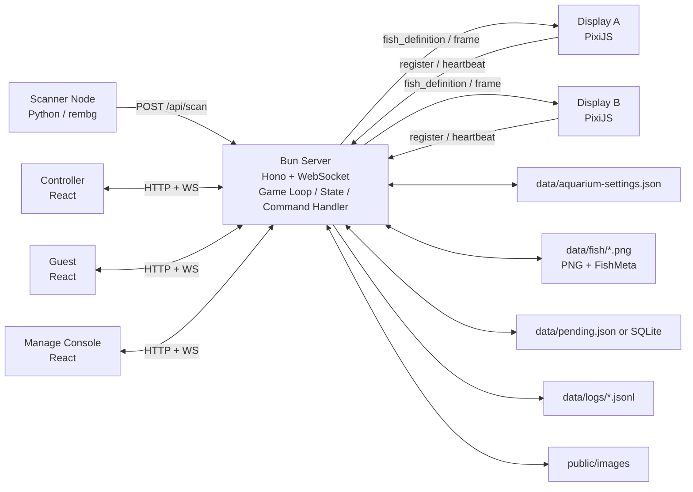
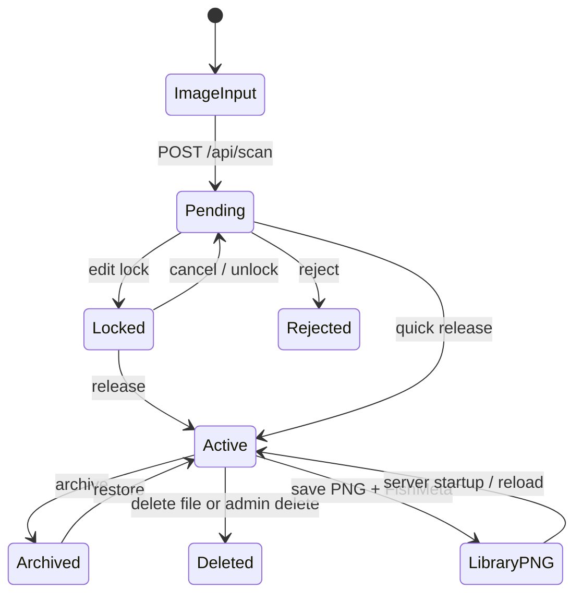

# おえかき水族館 完全版プロダクト仕様書

**文書種別:** 再実装可能なプロダクト仕様書  
**対象:** おえかき水族館 / Oekaki Aquarium  
**版:** v2.0  
**基準日:** 2026-06-04  
**目的:** 本仕様書だけを渡して、同等以上のプロダクトを再実装できる状態にする。  

---

## 0. この仕様書の位置づけ

本仕様書は、既存の「おえかき水族館」実装を基準に、展示運用で必要な安定性、復旧性、管理UI、画面設計、デザイン品質を統合した完全版仕様である。

本システムは、紙または端末で描いた魚を画像として取り込み、複数のブラウザディスプレイを一つの仮想水槽として接続し、魚が泳ぐ展示体験を提供する。

設計上の最重要方針は以下である。

1. **魚データの正本はPNGファイルとする。**  
   魚画像と魚設定は可能な限りPNGメタデータに保持し、エクスプローラーやFinderから人間が直接扱える状態にする。

2. **DBを魚データの正本にしない。**  
   SQLiteなどのDBは導入してもよいが、魚そのものをDBに閉じ込めない。DBはインデックス、履歴、Pending状態、操作ログなどの補助用途に限定する。

3. **現在位置は原則永続化しない。**  
   魚は常に泳ぎ、時間経過でランダムに拡散するため、現在座標は本質的なデータではない。サーバー起動時に魚ID、日付、World設定などから決定的または半決定的に再配置する。

4. **管理UIは万能にする。ただし通常画面にすべてを出さない。**  
   現地では何が起きるかわからないため、復旧・調整・デバッグ機能は持つ。ただし、通常運用、セットアップ、緊急復旧、デバッグを明確に分離する。

5. **管理UIは状態を直接編集せず、サーバーへコマンドを発行する。**  
   状態変更、保存、副作用、通知、検証はサーバー側のCommand Handlerに集約する。

6. **Displayは軽量で堅牢にする。**  
   Displayは描画に専念し、魚定義と毎フレーム座標を分離して受け取る。

7. **エサ機能は必須機能ではない。**  
   体験価値が薄い場合は削除する。残す場合も魚の物理挙動には影響させず、波紋や泡などの演出だけにする。

---

## 1. プロダクト概要

### 1.1 コンセプト

おえかき水族館は、来場者が描いた魚が大きな水槽画面の中で泳ぐ展示システムである。複数のディスプレイを仮想的に一つの水槽として扱い、魚は画面間をまたいで移動する。

### 1.2 想定運用

- 1日あたり8時間以上の連続稼働を想定する。
- 翌日も同じ魚データを使って再開できる。
- 展示現場ではネットワーク、ディスプレイ、ブラウザ、入力画像、誤操作などの不確実性がある。
- 専門開発者が常駐しない可能性があるため、管理UIから復旧できることを重視する。
- 閉域LAN内での展示運用を基本とする。インターネット公開は標準対象外とする。

### 1.3 利用者種別

| 利用者 | 画面 | 目的 |
|---|---|---|
| 運用管理者 | `/manage` | 状態監視、Pending処理、Display復旧、魚管理 |
| 設営担当者 | `/manage/setup` | Display配置、World設定、背景・レイヤー調整 |
| 緊急対応者 | `/manage/recovery` | 表示崩れ、接続不良、重さ、画像欠けの復旧 |
| 開発・技術担当者 | `/manage/debug` | 生状態、通信、ログ、計測値の確認 |
| 展示ディスプレイ | `/display` | 仮想水槽の一部を描画 |
| 魚登録担当者 | `/controller` | 撮影、画像処理、魚設定、放流 |
| 来場者 | `/guest` | 魚作成、必要なら演出操作 |

---

## 2. 全体アーキテクチャ

### 2.1 基本構成



### 2.2 技術スタック

Runtime:
  Bun

Backend:
  Hono for HTTP API
  Bun.serve WebSocket for realtime

Frontend:
  Vite
  React 19
  TanStack Router
  TanStack Query
  Tailwind CSS
  shadcn/ui style components

Rendering:
  PixiJS v8

Type / Protocol:
  TypeScript strict
  Zod 4
  shared protocol package

Persistence:
  PNG metadata for fish
  JSON for settings
  JSONL for logs
  optional SQLite only for diagnostics/session logs

Testing:
  Vitest
  Playwright
  soak test script

### 2.3 ポート

| ポート | 用途 |
|---|---|
| 3000 | 本番HTTP、API、WebSocket、画像、ビルド済み画面 |
| 5173 | Vite開発サーバー。APIとWSは3000へプロキシ |

未使用のUDPポートや旧WebSocket専用ポート定数は削除する。

---

## 3. データ設計

### 3.1 正本の考え方

| データ | 正本 | 理由 |
|---|---|---|
| 魚画像 | PNGファイル | 人間が直接見られる、コピーできる、救出しやすい |
| 魚基本設定 | PNG tEXtメタデータ | 画像と設定を一体管理できる |
| Active魚一覧 | `data/fish/*.png` の読み込み結果 | DBに閉じ込めない |
| 現在位置・速度 | メモリ | 保存価値が低く、再配置でよい |
| Pending状態 | JSONまたはSQLite | 再起動で消えると困る |
| Display Viewport | `aquarium-settings.json` | 設営情報として保存価値が高い |
| World設定 | `aquarium-settings.json` | 展示構成の正本 |
| 操作ログ | JSONL | 復旧・原因調査用 |

### 3.2 FishMeta

PNG tEXt keywordは `AquariumFish` とする。

```ts
interface FishMeta {
  version: 2;
  id: string;
  author?: string;
  type: FishType;
  scale: number;
  speed: number;
  rotationOffset: number;
  direction: "auto" | "left" | "right";
  pinnedLayerId?: number;
  isArchived: boolean;
  tags?: string[];
  createdAt: number;
  updatedAt: number;
}
```

### 3.3 PendingFish

Pendingはサーバー再起動で失われてはならない。軽量なJSONでよい。

```ts
interface PendingFish {
  id: string;
  imageUrl: string;
  sourceImageUrl?: string;
  processedImageUrl?: string;
  createdAt: number;
  updatedAt: number;
  lockedBy?: string;
  lockedAt?: number;
  fishMeta?: Partial<FishMeta>;
  status: "pending" | "locked" | "released" | "rejected";
}
```

ロックは永久に残してはならない。`lockedAt` から一定時間、たとえば10分経過したロックは管理UIから解除できる。

### 3.4 ActiveFish

ActiveFishはメモリ上の実行時状態である。

```ts
interface ActiveFish {
  config: FishConfig;
  physics: {
    x: number;
    y: number;
    vx: number;
    vy: number;
  };
  layerIndex: number;
  targetScale: number;
  targetOpacity: number;
  isArchived: boolean;
  runtime: Record<string, unknown>;
}
```

`physics` と `runtime` は永続化しない。

### 3.5 起動時の魚再配置

サーバー起動時には `data/fish/*.png` を読み込み、FishMetaからActiveFishを復元する。

現在位置は保存せず、以下のように初期配置する。

1. `fish.id`、`fish.createdAt`、`world.width`、`world.height`、任意で当日の日付からseedを作る。
2. seed付き疑似乱数で初期座標を決める。
3. Spawn Pointがある場合はSpawn Point周辺へ配置してもよい。
4. Valid Zoneが存在する場合はValid Zone内へ配置する。
5. Forbidden Zone内に入った場合は再抽選する。

これにより、完全ランダムより再現性があり、DB保存なしで再開できる。

---

## 4. World / Display / Viewport

### 4.1 World

Worldは魚が泳ぐグローバル座標空間である。初期値は以下とする。

```json
{
  "width": 1080,
  "height": 1440
}
```

Worldサイズはディスプレイ物理解像度とは独立する。

### 4.2 Display ID

Display IDは以下の優先順位で決定する。

1. URLクエリ `?id=main`
2. `localStorage["display-id"]`
3. 自動生成 `disp-xxxxxx`

Display IDは設営情報と対応するため、現場では固定ID付きURLを使用することを推奨する。

例:

```text
/display?id=left
/display?id=center
/display?id=right
```

### 4.3 Viewport

```ts
interface Viewport {
  x: number;
  y: number;
  width: number;
  height: number;
  scale?: number;
}
```

Displayは自分のViewport範囲だけを描画する。

```text
screenX = (worldX - viewport.x) * window.innerWidth  / viewport.width
screenY = (worldY - viewport.y) * window.innerHeight / viewport.height
```

### 4.4 Valid Zone

接続済みDisplayのViewportをValid Zoneとして扱う。魚の初期配置、放流位置、必要に応じた移動可能領域判定に使う。

通常魚が画面外の空白領域を通ることを許すかどうかは設定化する。

```ts
interface WorldConfig {
  movementAreaMode: "world_rect" | "valid_zones_union";
}
```

標準は `world_rect` とする。複雑なDisplay配置では `valid_zones_union` を選択できる。

### 4.5 Forbidden Zone

魚が侵入してはいけない矩形領域である。

```ts
interface ForbiddenZone {
  id: string;
  x: number;
  y: number;
  width: number;
  height: number;
  label?: string;
}
```

### 4.6 Spawn Point

```ts
interface SpawnPoint {
  id: string;
  x: number;
  y: number;
  label?: string;
}
```

複数ある場合はランダム選択する。未設定時はValid Zoneの左側中央、Valid Zoneもない場合はWorld左側中央を使用する。

---

## 5. 魚のライフサイクル



### 5.1 放流処理

1. Pending対象を取得する。
2. FishMetaを確定する。
3. PNG tEXtメタデータを書き込む。
4. `data/fish/<id>.png` に保存する。
5. Pending状態を `released` にする、またはPending一覧から除外する。
6. Active Poolへ追加する。
7. `fish_definition` をDisplayへブロードキャストする。
8. `fish_released` をManage / Controllerへ通知する。

### 5.2 アーカイブ

アーカイブされた魚は以下の扱いとする。

- PNGファイルは残す。
- FishMeta `isArchived = true` を保存する。
- 物理演算から除外する。
- Displayへ描画しない。
- 管理UIのArchived一覧から復元できる。

### 5.3 削除

削除には2段階を設ける。

| 操作 | 動作 |
|---|---|
| 非表示 / Archive | PNGを残して展示から除外 |
| 削除 / Delete | PNGを `data/trash` へ移動 |

本番展示中に即時完全削除はしない。復旧可能性を残す。

---

## 6. 魚の動き

### 6.1 FishType

| Type | 動作 |
|---|---|
| `tuna` | 高速な水平移動。Yレーンを一定間隔で変更する。 |
| `school` | Boids風の群れ。分離・整列・結合を行う。 |
| `squid` | 休止とパルス推進を繰り返す。 |
| `jellyfish` | ゆっくり漂い、上下に浮遊する。 |
| `shark` | 大きな弧を描いて単独回遊する。 |
| `anchor` | 床付近または指定位置で揺れる。 |
| `looper` | 手書きパスと潮流を組み合わせる。 |
| `swimmer` | 標準的な遊泳。旧互換として維持してよい。 |

### 6.2 速度倍率

```text
finalSpeed = layer.speedFactor × fish.userParams.speed × world.fishSpeedMultiplier
```

### 6.3 方向指定

`direction` が `left` または `right` の場合、X方向の移動を強制する。Displayでは進行方向に合わせて画像を左右反転する。


## 7. リアルタイム通信仕様

### 7.1 WebSocket登録

全クライアントは接続直後に `register` を送る。

```json
{
  "event": "register",
  "uuid": "display:left",
  "hardware": { "w": 1920, "h": 1080 }
}
```

### 7.2 クライアント種別

UUID prefixで判定する。

| prefix | 種別 |
|---|---|
| `display:` | Display |
| `manage:` | Manage |
| `controller:` | Controller |
| `guest:` | Guest |

### 7.3 Heartbeat

- クライアントは10秒ごとに送信する。
- サーバーは任意の受信メッセージを生存確認として扱う。
- 120秒受信がなければ切断扱いにする。
- 管理UIにはDisplay状態を5秒ごとにpushする。

### 7.4 Display状態モデル

| 状態 | 条件 | 管理UI表示 |
|---|---|---|
| `connected` | 正常接続中 | 緑 |
| `degraded` | FPS低下、bufferedAmount増加、画像失敗増加 | 黄 |
| `sleeping` | タブスリープ疑い、heartbeat遅延 | 黄 |
| `stale` | 一定時間応答なし | 橙 |
| `disconnected` | WebSocket切断 | 赤 |

### 7.5 Fish Definition

魚の静的情報は、放流時、ライブラリ再読み込み時、Display再接続時に送信する。

```json
{
  "event": "fish_definition",
  "fish": {
    "id": "fish_abc123",
    "textureUrl": "/lib-images/fish_abc123.png",
    "type": "school",
    "baseScale": 1.0,
    "direction": "auto",
    "author": "",
    "isArchived": false
  }
}
```

### 7.6 Fish Removed

```json
{
  "event": "fish_removed",
  "id": "fish_abc123"
}
```

### 7.7 Frame

毎フレーム送るのは変化する値だけにする。画像URLは含めない。

```json
{
  "event": "frame",
  "t": 1770000000000,
  "f": [
    {
      "id": "fish_abc123",
      "x": 500,
      "y": 300,
      "r": 0.1,
      "s": 1.0,
      "o": 1.0,
      "z": 100,
      "l": 0,
      "d": 1
    }
  ],
  "effects": []
}
```

魚IDは短縮しない。短縮IDによる衝突を避ける。

### 7.8 Frame送信制御

- 目標60fps。
- WebSocket `bufferedAmount` が512KBを超えるDisplayには古いframeを積まない。
- 送信詰まり時は最新frameのみ送る。
- Displayごとに実FPS、受信FPS、描画FPSを計測する。

---

## 8. Command API設計

### 8.1 方針

管理UIはサーバー内部状態を直接変更しない。すべての操作はCommandとしてサーバーへ送る。

サーバー側の `applyAdminCommand(command)` が以下を担当する。

- 入力検証
- 権限・モード確認
- 状態変更
- 永続化
- WebSocket通知
- 操作ログ記録
- エラー応答

### 8.2 AdminCommand

```ts
type AdminCommand =
  | { type: "PAUSE_WORLD" }
  | { type: "RESUME_WORLD" }
  | { type: "RELOAD_FISH_LIBRARY" }
  | { type: "RELOAD_DISPLAY"; displayId: string }
  | { type: "RELOAD_ALL_DISPLAYS" }
  | { type: "SET_DISPLAY_VIEWPORT"; displayId: string; viewport: Viewport }
  | { type: "PREVIEW_DISPLAY_VIEWPORT"; displayId: string; viewport: Viewport }
  | { type: "CANCEL_DISPLAY_VIEWPORT_PREVIEW"; displayId: string }
  | { type: "SET_DISPLAY_SETUP_MODE"; displayId: string; enabled: boolean }
  | { type: "SET_WORLD_SIZE"; width: number; height: number }
  | { type: "SET_BACKGROUND"; url?: string }
  | { type: "ADD_APP_LAYER"; layer: AppLayerConfig }
  | { type: "UPDATE_APP_LAYER"; id: string; patch: Partial<AppLayerConfig> }
  | { type: "DELETE_APP_LAYER"; id: string }
  | { type: "ADD_FORBIDDEN_ZONE"; zone: ForbiddenZone }
  | { type: "UPDATE_FORBIDDEN_ZONE"; id: string; patch: Partial<ForbiddenZone> }
  | { type: "DELETE_FORBIDDEN_ZONE"; id: string }
  | { type: "ADD_SPAWN_POINT"; point: SpawnPoint }
  | { type: "UPDATE_SPAWN_POINT"; id: string; patch: Partial<SpawnPoint> }
  | { type: "DELETE_SPAWN_POINT"; id: string }
  | { type: "UPDATE_FISH"; fishId: string; patch: Partial<FishMeta> }
  | { type: "ARCHIVE_FISH"; fishId: string }
  | { type: "RESTORE_FISH"; fishId: string }
  | { type: "DELETE_FISH"; fishId: string }
  | { type: "REDISTRIBUTE_FISH" }
  | { type: "SET_TEST_PATTERN"; displayId?: string; pattern: TestPattern }
  | { type: "RESTORE_LAST_GOOD_CONFIG" }
  | { type: "SCAN_PENDING_DIR" }
  | { type: "CLEAR_STALE_LOCKS" };
```

### 8.3 HTTP Endpoint

```http
POST /api/admin/command
Content-Type: application/json
```

Request:

```json
{
  "command": {
    "type": "RELOAD_ALL_DISPLAYS"
  }
}
```

Response:

```json
{
  "ok": true,
  "commandId": "cmd_abc123",
  "stateVersion": 42
}
```

失敗時:

```json
{
  "ok": false,
  "error": {
    "code": "INVALID_VIEWPORT",
    "message": "Viewport width must be greater than 1"
  }
}
```

---

## 9. HTTP API

### 9.1 基本

| Method | Path | 用途 |
|---|---|---|
| GET | `/health` | サーバー生存確認 |
| GET | `/api/state` | 管理UI向け状態取得 |
| POST | `/api/admin/command` | 管理操作の統一入口 |

### 9.2 画像・Pending

| Method | Path | 用途 |
|---|---|---|
| POST | `/api/scan` | 画像アップロード、Pending追加 |
| GET | `/api/pending` | Pending一覧 |
| POST | `/api/pending/lock` | 編集ロック取得 |
| POST | `/api/pending/unlock` | 編集ロック解除 |
| DELETE | `/api/pending/:id` | 拒否、削除 |
| POST | `/api/release` | Pending魚を放流 |
| POST | `/api/png/configure` | FishMeta入りPNGを返す |

### 9.3 魚ライブラリ

| Method | Path | 用途 |
|---|---|---|
| GET | `/api/library` | `data/fish` 一覧 |
| POST | `/api/library/reload` | PNGライブラリから再読み込み |
| POST | `/api/library/:filename/release` | PNGを直接放流 |

### 9.4 静的ファイル

| Path | 内容 |
|---|---|
| `/images/*` | 入力画像、処理済み画像、シーン画像 |
| `/lib-images/*` | 永続魚PNG |
| `/app/*` | ビルド済みFrontend assets |

---

## 10. 画面設計

## 10.1 全体ナビゲーション

`/` はポータル画面とする。

表示するリンク:

- 管理画面 `/manage`
- セットアップ `/manage/setup`
- 緊急復旧 `/manage/recovery`
- デバッグ `/manage/debug`
- Display `/display?id=...`
- Controller `/controller`
- Guest `/guest`

ポータルは本番展示では非表示にしてもよい。

---

## 10.2 管理UI共通デザイン

### デザイン方針

管理UIは「イベント運営用の管制卓」として設計する。

見た目の方向性:

- プロフェッショナル
- 落ち着いたダークUI
- 高密度だが読みやすい
- 状態が一目で分かる
- 危険操作が視覚的に隔離されている
- 展示現場で焦っていても誤操作しにくい

### スタイル指示

- 背景は深いネイビーまたはチャコール系。
- パネルは半透明または低コントラストのカードで分割する。
- 状態色は意味を固定する。
  - 緑: 正常
  - 黄: 注意
  - 橙: 復旧要
  - 赤: 危険または停止
  - 青: 操作可能または選択中
- 角丸は控えめにする。
- 装飾よりも情報密度と視認性を優先する。
- ボタンはPrimary、Secondary、Danger、Ghostを明確に分ける。
- Danger操作は確認ダイアログを必須にする。
- フォントはシステムUIフォントを使う。数値はtabular-numsを使う。

### 共通レイアウト

```text
┌──────────────────────────────────────────────────────────────┐
│ Header: Logo / Mode / Server status / Clock / Emergency stop │
├───────────────┬──────────────────────────────────────────────┤
│ Sidebar       │ Main Content                                  │
│ - Overview    │                                              │
│ - Displays    │                                              │
│ - Fish        │                                              │
│ - Pending     │                                              │
│ - Setup       │                                              │
│ - Recovery    │                                              │
│ - Debug       │                                              │
└───────────────┴──────────────────────────────────────────────┘
```

---

## 10.3 `/manage` 通常運用画面

### 目的

展示中に常時開く画面。安全な操作だけを出す。

### 主要コンポーネント

1. **Status Overview**
   - サーバー稼働時間
   - World状態: Running / Paused
   - Display接続数
   - 魚数
   - Pending数
   - 最終保存時刻
   - frame payload size

2. **Display Health Cards**
   - Display ID
   - 接続状態
   - 最終heartbeat
   - 描画FPS
   - bufferedAmount
   - 現在のViewport
   - `Reload` ボタン

3. **Pending Queue**
   - サムネイル
   - 作成時刻
   - ロック状態
   - Quick release
   - Reject
   - Open in Controller

4. **Active Fish Quick Control**
   - 検索
   - サムネイル一覧
   - Archive
   - Restore
   - Delete to trash

5. **Safe Operations**
   - Pause World
   - Resume World
   - Reload Fish Library
   - Reload All Displays
   - Clear Stale Locks

### 通常画面に出してはいけない操作

- Worldサイズ変更
- Display Viewport編集
- 背景差し替え
- レイヤー編集
- JSON直接編集
- 全削除
- 強制状態書き換え

これらはSetup、Recovery、Debugへ隔離する。

---

## 10.4 `/manage/setup` セットアップ画面

### 目的

設営時にDisplay配置、背景、World、レイヤー、禁止エリア、放流ポイントを調整する。

### 画面構成

```text
┌──────────────────────────────────────────────────────────────┐
│ Setup Header: Setup Mode ON / Save / Revert / Test Pattern   │
├─────────────┬───────────────────────────────┬────────────────┤
│ Tool Panel  │ World Canvas                   │ Inspector      │
│ - Select    │ - World boundary               │ - Selected obj │
│ - Display   │ - Display rectangles           │ - X/Y/W/H      │
│ - Layer     │ - Background                   │ - opacity      │
│ - Zone      │ - Forbidden zones              │ - zIndex       │
│ - Spawn     │ - Spawn points                 │ - actions      │
└─────────────┴───────────────────────────────┴────────────────┘
```

### 操作モード

| Mode | 操作対象 |
|---|---|
| Select | オブジェクト選択 |
| Display | Viewport移動・リサイズ |
| Image Layer | 背景・装飾画像 |
| Forbidden Zone | 進入禁止エリア |
| Spawn Point | 放流位置 |
| Fish Preview | 魚の分布確認のみ |

### Display編集

- ドラッグ移動
- リサイズ
- アスペクト比固定リサイズ
- World境界スナップ
- 他Display境界スナップ
- 数値入力
- 対象DisplayへのPreview送信
- 確定時のみ保存

### Display側セットアップモード

通常の `/display?id=A` ではDisplay上のViewport直接操作を無効にする。

以下の場合だけ操作可能にする。

```text
/display?id=A&setup=1
```

または、管理UIから `SET_DISPLAY_SETUP_MODE` を送る。

セットアップモード中のDisplayには以下を常時表示する。

- Display ID
- Viewport座標
- World grid
- Safe area
- Calibration pattern

---

## 10.5 `/manage/recovery` 緊急復旧画面

### 目的

現場で問題が起きたときに、原因を細かく直すのではなく、安全側に戻す。

### 機能

| 機能 | 説明 |
|---|---|
| Reload All Displays | 全Displayへreloadイベント送信 |
| Restart WebSocket Sessions | Display接続を切断し再接続を促す |
| Restore Last Good Config | 最後に正常保存された設定へ戻す |
| Redistribute Fish | 魚をWorld内へ再配置 |
| Pause World | 物理演算を停止 |
| Resume World | 物理演算を再開 |
| Scan Fish Library | PNGライブラリを再スキャン |
| Scan Pending Directory | Pending画像を再スキャン |
| Hide Heavy / Broken Fish | 読み込み失敗が多い魚を一時非表示 |
| Clear Stale Locks | 期限切れ編集ロックを解除 |

### UX要件

- 各操作には「何が起きるか」を1行で表示する。
- 危険操作は確認ダイアログを出す。
- 操作実行後は結果ログを表示する。
- 成功・失敗・部分成功を明確に出す。

---

## 10.6 `/manage/debug` デバッグ画面

### 目的

技術担当者向けの低レベル情報確認画面。

### 表示項目

- Raw `/api/state`
- connected clients
- WebSocket message rate
- frame payload size
- server tick time
- memory usage
- image load failures
- fish definitions cache
- command log
- operation log
- latest errors

### 注意

Debug画面は通常運用者に見せなくてよい。明示的なDeveloper Modeでのみ表示する。

---

## 10.7 `/display`

### 目的

展示画面として魚、水槽、背景、レイヤー、演出を描画する。

### 要件

- 全画面表示を前提とする。
- UI装飾は原則表示しない。
- Display IDは右下などに小さく出してもよいが、本番では非表示設定を可能にする。
- WebSocket切断時は自動再接続する。
- 30秒以上更新がなければ再接続する。
- Screen Wake Lockを取得する。
- テクスチャ読み込み失敗時はプレースホルダーを表示し、再試行する。

### テストパターン

| Pattern | 用途 |
|---|---|
| `off` | 通常表示 |
| `identify` | Display番号表示 |
| `grid` | 格子確認 |
| `colorbars` | 色確認 |
| `white` | 全白 |
| `black` | 全黒 |
| `crosshair` | 中央・四隅確認 |
| `worldmap` | World座標確認 |
| `calibration` | 設営用総合表示 |

---

## 10.8 `/controller`

### 目的

魚登録担当者が、撮影した画像を処理し、魚設定を調整して放流する。

### 画面フロー

```text
Gallery / Pending
  ↓
Capture / Upload
  ↓
Image Processing Preview
  ↓
Fish Editor
  ↓
Release Complete
```

### Gallery

- Pending一覧を表示する。
- ロック中の魚は編集不可にする。
- 編集開始時にlockを取得する。
- キャンセル時にunlockする。

### Image Processing

理想フロー:

1. 撮影
2. EXIF回転補正
3. 用紙四隅自動検出
4. 4点手動調整
5. 台形補正
6. 背景除去
7. 透明余白トリミング
8. 長辺1024pxへ正規化
9. プレビュー確認

台形補正が未実装の場合は、白紙背景前提の自動背景除去を使う。

### Fish Editor

- 魚画像プレビュー
- 動きタイプ
- 大きさ
- 速さ
- 泳ぐ方向
- 回転補正
- レイヤーピン留め
- 手書きモーションパス
- 設定入りPNGダウンロード
- 放流

---

## 10.9 `/guest`

### 方針

Guest画面は複雑にしない。主役は魚作成である。

### 標準機能

- 魚を撮影・アップロードする。
- 簡易Editorで大きさ、速さ、方向を設定する。
- 放流する。

### 任意機能

演出操作を残す場合は、タップで波紋や泡だけを出す。

- 魚の物理挙動には影響しない。
- Worldサイズは必ずサーバーから取得する。
- 固定 `3840 x 1080` の座標変換は禁止する。

---

## 11. デザイン詳細

### 11.1 ブランドトーン

- 子ども向け展示として親しみはあるが、管理UIは業務用の質感にする。
- Displayは没入感を優先する。
- ControllerとGuestは迷わない導線を優先する。

### 11.2 Displayビジュアル

- 背景は水中らしい奥行き感を出す。
- 魚レイヤーは前景、中景、遠景でスケール、透明度、速度を変える。
- 急激な動きよりも、ゆっくりした連続性を優先する。
- 画像読み込み中のプレースホルダーは展示の雰囲気を壊さないデザインにする。

### 11.3 Manageビジュアル

- 管制卓風。
- 情報カード、ステータスバッジ、ミニマップ、ログを使う。
- 操作ボタンは小さすぎない。
- 現場の低解像度ディスプレイでも読めるサイズにする。

### 11.4 Controller / Guestビジュアル

- 白または明るめのUIでもよい。
- ステップ式にする。
- 一画面に詰め込みすぎない。
- 放流完了時は明確な成功画面を出す。

---

## 12. 永続化

### 12.1 Aquarium Settings

保存先:

```text
data/aquarium-settings.json
```

保存対象:

```ts
interface AquariumSettings {
  version: 2;
  world: {
    width: number;
    height: number;
    horizontalBoundaryMode: "wrap" | "bounce";
    fishSpeedMultiplier: number;
    movementAreaMode: "world_rect" | "valid_zones_union";
  };
  displays: Record<string, Viewport>;
  background?: { url: string };
  appLayers: AppLayerConfig[];
  forbiddenZones: ForbiddenZone[];
  spawnPoints: SpawnPoint[];
  sceneObjects: WorldObject[];
  updatedAt: number;
}
```

書き込みは一時ファイルへ保存してからrenameする。破損に備えて世代バックアップを保持する。

```text
data/backups/aquarium-settings-YYYYMMDD-HHmmss.json
```

### 12.2 Pending Store

保存先は以下のどちらかとする。

```text
data/pending.json
```

または

```text
data/aquarium.sqlite
```

標準はJSONでよい。大量運用や検索が必要ならSQLiteに移行する。

### 12.3 Logs

操作ログはJSONLで保存する。

```text
data/logs/operations-YYYYMMDD.jsonl
```

1行の例:

```json
{"t":1770000000000,"actor":"manage:main","command":"RELOAD_ALL_DISPLAYS","ok":true}
```

---

## 13. 非機能要件

### 13.1 性能

| 項目 | 目標 |
|---|---|
| サーバーtick | 60fps目標 |
| Display描画 | 60fps目標、最低30fps |
| WebSocket heartbeat | 10秒 |
| Display heartbeat timeout | 120秒 |
| テクスチャ同時ロード | 最大6 |
| frame送信バックプレッシャー | 512KB超で古いframe破棄 |
| 連続稼働 | 8時間以上 |

### 13.2 耐障害性

- Display再接続時にfish_definitionを再送する。
- Display IDが同じならViewportを復元する。
- 管理UIからDisplayを個別・全体Reloadできる。
- Fish PNGが残っていれば魚は復元できる。
- Pendingは再起動で消えない。
- 設定ファイルは世代バックアップから復元できる。
- 画像ロード失敗が多い魚は管理UIで特定できる。

### 13.3 セキュリティ

標準は閉域LAN運用である。

禁止:

- インターネットへ認証なし公開すること。

最低限必要な制限:

- アップロード容量上限
- MIME type検証
- 画像処理タイムアウト
- path traversal防止
- CORS制限
- 管理APIの簡易認証またはLAN限定

---

## 14. 実装構成

推奨ディレクトリ:

```text
packages/
  shared/
    src/
      types.ts
      protocol.ts
      commands.ts
      constants.ts
  server/
    src/
      index.ts
      ws-handler.ts
      command-handler.ts
      state-manager.ts
      game-loop.ts
      fish-manager.ts
      settings-store.ts
      pending-store.ts
      png-metadata.ts
      image-processing.ts
      logger.ts
      routes/
        scan.ts
        pending.ts
        release.ts
        library.ts
        state.ts
        admin-command.ts
  frontend/
    src/
      display/
      manage/
        common/
        operations/
        setup/
        recovery/
        debug/
      controller/
      guest/
scanner/
  monitor.py
data/
  fish/
  pending/
  trash/
  backups/
  logs/
```

### 14.1 状態管理原則

Frontendの管理画面では状態を3種類に限定する。

| 種類 | 内容 |
|---|---|
| Server Snapshot | `/api/state` またはWS pushで得た正本 |
| Draft State | ドラッグ中、フォーム編集中の一時状態 |
| UI State | 選択タブ、選択オブジェクト、ズーム率 |

魚一覧、Display一覧、World設定をFrontend側で正本化してはならない。

---

## 15. 受け入れ基準

### 15.1 8時間展示

- 8時間連続でDisplayが描画を継続する。
- Displayが一時切断しても自動再接続する。
- 管理UIからDisplayを再読み込みできる。
- 魚の画像欠けが発生した場合、管理UIで検出できる。
- サーバー再起動後、`data/fish` の魚が再表示される。
- Pending中の魚が再起動で消えない。

### 15.2 翌日再開

- 前日に放流した魚PNGが残っている。
- サーバー起動時に魚が再読み込みされる。
- 現在位置は保存されなくてよいが、World内に自然に再配置される。
- Display Viewportは前日設定を復元する。
- 背景、レイヤー、禁止エリア、放流ポイントを復元する。

### 15.3 管理UI

- 通常運用画面に危険操作が表示されない。
- セットアップ画面でDisplayを移動・リサイズできる。
- 緊急復旧画面から全Display reload、魚再配置、ライブラリ再読込ができる。
- デバッグ画面で通信状態とログを確認できる。
- すべての管理操作はCommand API経由で実行される。

### 15.4 Display

- `fish_definition` を受け取ってテクスチャをキャッシュする。
- `frame` には画像URLが含まれていなくても描画できる。
- Display IDが同じなら再接続後も同じViewportを使う。
- 通常モードではDisplay上のドラッグでViewportが動かない。
- setupモードだけDisplay上で調整できる。

### 15.5 Controller

- Pending一覧が表示される。
- 編集ロックが機能する。
- 画像をアップロードして透明PNGにできる。
- FishMetaを設定できる。
- 放流後にPNGへメタデータが保存される。

---

## 16. 実装優先順位

### Phase 1: 安定化

1. `frame` から画像URLを外し、`fish_definition` と分離する。
2. Display通常モードでViewport直接操作を無効にする。
3. setupモードだけDisplay直接操作を許可する。
4. エサ機能を削除、または演出だけへ降格する。
5. PendingをJSONで永続化する。
6. アップロード容量上限とMIME検証を入れる。

### Phase 2: 管理UI再設計

1. `/manage`、`/manage/setup`、`/manage/recovery`、`/manage/debug` に分離する。
2. 管理操作をCommand APIへ統一する。
3. 旧Zustand storeなど二重状態を削除する。
4. Server Snapshot / Draft State / UI Stateへ分ける。
5. 操作ログをJSONLへ保存する。

### Phase 3: 展示運用強化

1. Display Health Cardを実装する。
2. frame payload size、server tick time、Display FPSを表示する。
3. Last Good Configと世代バックアップを実装する。
4. Broken Fish検出と一時非表示を実装する。
5. Controller画像処理に台形補正フローを追加する。

---

## 17. 明示的に採用しない方針

以下は標準仕様では採用しない。

1. 魚データの正本をSQLiteにする。  
   理由: 人間がエクスプローラーから扱いづらくなる。

2. 魚の現在位置を永続化する。  
   理由: 魚は時間経過で拡散するため保存価値が低い。

3. 管理UIの通常画面にすべての操作を置く。  
   理由: 現地対応力が上がるように見えて、誤操作と実装破損のリスクが増える。

4. エサを魚の物理挙動に影響させる。  
   理由: 体験価値に比べて複雑性と不具合範囲が大きい。

5. Display上のViewportドラッグを常時有効にする。  
   理由: 展示中の誤操作リスクがある。

---

## 18. 完了定義

本プロダクトは以下を満たした時点で、展示運用可能なv2として完了とする。

- 魚PNGとFishMetaだけで魚を復元できる。
- Pendingが再起動で消えない。
- Displayがfish_definitionとframe分離プロトコルで描画できる。
- 管理UIが通常、セットアップ、緊急復旧、デバッグに分離されている。
- 管理操作がCommand APIへ統一されている。
- Displayの通常モードでは誤操作でViewportが動かない。
- 現場でDisplay再読み込み、魚再配置、ライブラリ再読込、Last Good Config復元ができる。
- 8時間連続稼働試験を通過する。
- 翌日再起動後に魚、World設定、Display配置、背景、レイヤーが復元される。

