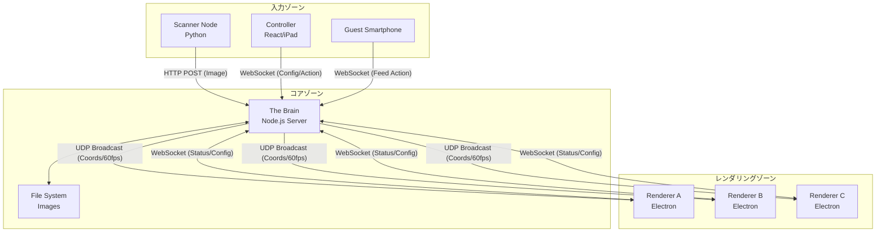
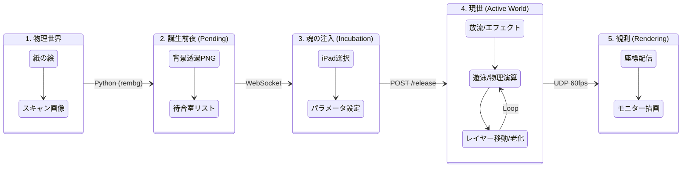
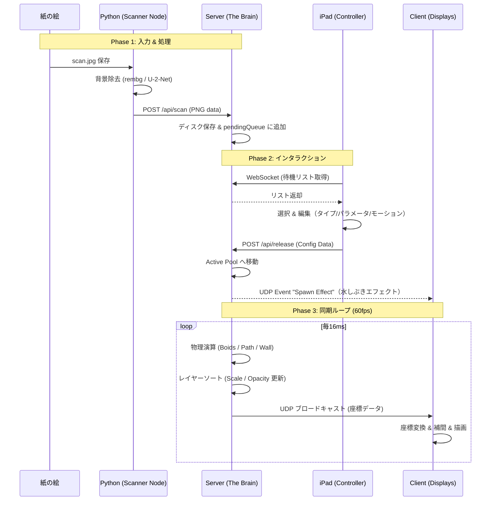

# Digital Aquarium Project - Technical Specification

**Version:** 1.0.0
**Status:** Draft
**Last Updated:** 2026-02-26

---

## 1. プロジェクト概要 (Overview)

本システムは、ユーザーが描いた絵を取り込み、複数のディスプレイを連結した巨大な仮想空間で遊泳させるインタラクティブアートシステムである。
中央サーバーによる物理演算と、UDPブロードキャストによる分散レンダリングを組み合わせ、高解像度かつ低遅延な同期描画を実現する。

### コア機能

| # | 機能名 | 概要 |
|---|--------|------|
| 1 | **Analog to Digital** | スキャナーで取り込んだ手描きの絵を自動で切り抜き、水槽に放流する |
| 2 | **Multi-Monitor Sync** | 複数のPC/ディスプレイを、サーバー側で定義された単一の巨大空間として同期させる |
| 3 | **User Interaction** | iPadを用いて、取り込んだ魚の「動き」「性格」をユーザー自身が設定する |
| 4 | **Smartphone Feeding** | 来場者のスマホからエサを投入し、魚群と対話する |
| 5 | **Digital Souvenir** | 自分の魚の画像をQRコード経由で持ち帰る（静止画） |

### スコープ外（Out of Scope）

以下の機能は開発コスト・リスクを考慮し、**Version 2.0以降の検討事項**とする。

| 機能 | 除外理由 |
|------|----------|
| LiDARタッチ | 実装コストと現地調整リスクが高い |
| 動画生成 | サーバー負荷と生成待ち時間のリスクが高い（静止画で代替） |

---

## 2. システムアーキテクチャ (Architecture)

### 2.1 構成図



### 2.2 コンポーネント定義

| Component | Tech Stack | Role |
|-----------|-----------|------|
| **The Brain (Server)** | Node.js (TypeScript), Fastify, `dgram`, `ws` | 物理演算、状態管理、クライアント統合制御、画像配信 |
| **Renderer (Client)** | Electron, Pixi.js (TypeScript) | GPU描画、UDP受信・補間処理、座標変換 |
| **Scanner Node** | Python 3.x, `rembg`, `watchdog` | 画像監視、背景除去AI、アップロード |
| **Controller** | React, Vite (TypeScript) | 待機魚の選択、モーション設定、放流トリガー |
| **Guest UI** | React (Web) | QRコード読み取り後のエサやり画面 |

---

## 3. 魚のライフサイクル (Fish Life Cycle)

魚データがシステム内でどのように生まれ、変容し、表示されるまでの全ライフサイクルを定義する。

### 3.1 状態遷移図



### 3.2 データ構造の変遷

データが旅をする中で、以下のように形を変える。

```
1. iPad (Input)
   { "type": "looper", "userParams": { "scale": 1.5, "speed": 1.2 } }

↓ サーバーがレイヤーロジック・物理演算を適用

2. Server Logic (Active Fish Object)
   { id, type, physics: { pos, vel }, layer: 0, config: { scale, speed } }

↓ 転送量削減のため軽量化

3. UDP Packet (Transport)
   { "i": "a1", "x": 2050, "y": 500, "r": 0.1, "s": 0.7, "o": 0.8 }
   // s: scale (レイヤー補正済み), o: opacity

↓ クライアントが座標変換・補間処理を適用

4. Client (Render)
   sprite.x = 130; sprite.alpha = 0.8;
```

---

## 4. 機能仕様詳細 (Functional Specs)

### 4.1 空間管理 (Virtual Tank)

サーバーは `WorldWidth × WorldHeight` の巨大な仮想座標系を持つ。

| エリア | 定義 | 挙動 |
|--------|------|------|
| **Valid Zone (生存圏)** | 接続された各クライアントの `Viewport(x, y, w, h)` を統合したエリア | 魚が通常遊泳できる領域 |
| **Void (虚無)** | Valid Zone以外の領域 | 魚が侵入した場合、最近傍のValid Zoneへ強制的に押し戻す（Repulsion Force） |
| **Floor (床)** | 各クライアントの下端 (`y + h`) | Type C（固定）の魚はここに配置される |

### 4.2 レイヤーシステム (Depth Management / ところてん方式)

新しい魚が放流されるたびに古い魚を奥へ送ることで、時間的な奥行き表現を実現する。

#### Layer Configuration

```typescript
// config/layers.ts
export const LAYER_CONFIG = [
  // 第0層: 最前列 (最新の魚)
  { id: 0, maxCount: 10,  scale: 1.0, opacity: 1.0, speedFactor: 1.0, zIndex: 100 },
  // 第1層: 中景
  { id: 1, maxCount: 20,  scale: 0.7, opacity: 0.8, speedFactor: 0.6, zIndex: 50 },
  // 第2層: 遠景 (古い魚)
  { id: 2, maxCount: 50,  scale: 0.4, opacity: 0.4, speedFactor: 0.3, zIndex: 10 },
];
```

#### ところてん更新ロジック（サーバー実行・魚追加時または定期実行）

1. 全魚を「ピン留め済み」と「一般」に分離する
2. 一般魚を `timestamp` の降順（新しい順）でソートする
3. 先頭から順にLayer Configの `maxCount` の枠に割り当てる
4. ピン留め魚は枠を無視して指定レイヤー（デフォルト: Layer 0）に強制配置する

#### ピン留め (Pin) 機能

| プロパティ | 型 | 説明 |
|------------|-----|------|
| `isPinned` | `boolean` | `true` の場合、ところてんロジックを無視 |
| `pinnedLayerId` | `number?` | ピン留め先レイヤーID（デフォルト: `0`） |

> **Parallax Effect（重要）:** `speedFactor` を物理演算の移動量に乗算することで、「奥の魚はゆったり見える」パララックス効果を実現する。

### 4.3 魚の挙動タイプ (Motion Types)

| Type | 名称 | 動作原理 | 代表例 | 設定パラメータ |
|------|------|----------|--------|----------------|
| **A** | Swimmer (Boids) | 群衆シミュレーション（分離・整列・結合）＋壁回避 | サメ、魚 | `maxSpeed`, `maxForce` |
| **B** | Looper (Relative Path) | 潮流による全体移動（Global X）＋手描きローカル軌跡（Local X, Y） | クラゲ | モーションパス配列 |
| **C** | Anchor (Fixed) | X座標固定、Y座標はFloor Yに固定。手描きの揺れアニメーションを適用 | チンアナゴ | モーションパス配列（揺れ） |

### 4.4 入力パイプライン (Input Pipeline)



#### iPadコントローラー操作フロー

1. **待合室ギャラリー表示:** `pendingQueue` の魚を一覧表示
2. **排他制御（ロック）:** 他ユーザーが編集中の魚は選択不可
3. **回転補正:** 魚の頭が右向き（0度）になるよう正規化
4. **タイプ & パラメータ設定:** Type A/B/C の選択、大きさ・速さを設定
5. **モーション録画:** タッチドラッグで軌跡を記録（スムージング処理必須）
6. **放流:** 設定データを `POST /api/release` で送信

### 4.5 エサやり機能 (Feeding)

| 項目 | 仕様 |
|------|------|
| **トリガー** | ゲストスマホまたはiPadからのWebSocketメッセージ |
| **エサオブジェクト** | 指定座標に生成される「強い引力を持つ不可視オブジェクト」 |
| **寿命** | 一定時間（例: 5秒）で消滅 |
| **魚への影響** | ターゲットベクトルを一時的にエサ座標へ向ける |

---

## 5. ネットワークプロトコル (Network Protocol)

### 5.1 UDP Broadcast (Port: 41234)

**Direction:** Server → All Clients  
**Frequency:** 60 Hz  
**Format:** JSON (MVP段階、将来的にMessagePackへ移行検討)

```json
{
  "t": 1735000000123,
  "f": [
    {
      "i": "uuid-v4-short",
      "x": 1200,
      "y": 500,
      "r": 1.57,
      "s": 1.0,
      "o": 1.0,
      "z": 100
    }
  ],
  "e": []
}
```

| フィールド | 型 | 説明 |
|------------|-----|------|
| `t` | `number` | Timestamp (Unix ms) |
| `f` | `array` | 魚リスト |
| `f[].i` | `string` | 魚ID (shortened UUID) |
| `f[].x` | `number` | Global X 座標 |
| `f[].y` | `number` | Global Y 座標 |
| `f[].r` | `number` | 回転角（ラジアン） |
| `f[].s` | `number` | スケール（レイヤー補正済み） |
| `f[].o` | `number` | 透明度（レイヤー補正済み） |
| `f[].z` | `number` | Z-Index |
| `e` | `array` | イベント（エフェクト座標等） |

### 5.2 WebSocket (Port: 8080)

**Direction:** 双方向

#### Client → Server

```jsonc
// クライアント登録
{ "event": "register", "uuid": "...", "hardware": { "w": 1920, "h": 1080 } }

// 死活監視
{ "event": "heartbeat", "fps": 60 }

// エサやりアクション（iPad/スマホ）
{ "event": "spawn_food", "x": 500, "y": 500 }
```

#### Server → Client

```jsonc
// ビューポート設定配信
{ "event": "config", "viewport": { "x": 0, "y": 0, "scale": 1.0 }, "debug": true }

// アプリ再起動指示
{ "event": "reload" }
```

### 5.3 HTTP API (Port: 3000)

| Method | Path | 説明 |
|--------|------|------|
| `POST` | `/api/scan` | スキャナーからの画像アップロード (`multipart/form-data`) |
| `GET` | `/api/pending` | 待機中の魚リスト取得 |
| `POST` | `/api/release` | 魚の本番登録（放流） |
| `POST` | `/api/fish/:id/pin` | 魚のピン留め設定 |
| `GET` | `/images/:filename` | 静的画像配信 |

#### `POST /api/fish/:id/pin` Payload

```json
{
  "pinned": true,
  "layerId": 0
}
```

---

## 6. データ構造定義 (Core Types)

```typescript
// packages/shared/types.ts

export interface FishConfig {
  id: string;
  type: 'swimmer' | 'looper' | 'anchor';
  textureUrl: string;          // e.g., "http://server/images/xxx.png"
  userParams: {
    scale: number;
    speed: number;
    rotationOffset: number;    // 回転補正値（ラジアン）
  };
  motionPath?: { x: number; y: number }[]; // Type B/C 用手書き軌跡
  isPinned?: boolean;
  pinnedLayerId?: number;
}

export interface ActiveFish extends FishConfig {
  timestamp: number;           // 放流時刻（レイヤーソートのキー）
  physics: {
    pos: { x: number; y: number };
    vel: { x: number; y: number };
    speedMultiplier: number;   // レイヤーのspeedFactorが反映される
  };
  layerIndex: number;          // 現在の所属レイヤー
  targetScale: number;         // クライアント補間の目標値
  targetOpacity: number;       // クライアント補間の目標値
}

export interface PendingFish {
  id: string;
  imageUrl: string;
  timestamp: number;
  lockedBy?: string;           // 排他制御: 編集中のiPad UUID
}

export interface ClientConfig {
  uuid: string;
  name: string;
  viewport: {
    x: number;
    y: number;
    width: number;
    height: number;
    scale: number;             // FHD/4K差異を吸収する表示倍率
  };
  debug: {
    showGrid: boolean;
    showId: boolean;
  };
}

export interface LayerConfig {
  id: number;
  maxCount: number;
  scale: number;
  opacity: number;
  speedFactor: number;
  zIndex: number;
}
```

---

## 7. クライアント側レンダリング仕様

### 7.1 ビューポートフィルタリング

各クライアントは自分の担当エリアのみを描画する。

```
自分のOffset X = 1920 の場合:
  魚の Global X = 5000 → 担当範囲外 → 無視（描画しない）
  魚の Global X = 2000 → 担当範囲内 → 採用
  Screen X = (Global X - My Offset X) * Scale
           = (2000 - 1920) * 1.0 = 80
```

### 7.2 補間処理 (Linear Interpolation)

UDPパケットロスによるガタつきをクライアント側の Lerp で吸収する。

```typescript
// 座標（高速に追従）
sprite.x = lerp(sprite.x, fish.x, 0.1);
sprite.y = lerp(sprite.y, fish.y, 0.1);

// スケール・透明度（ゆっくり変化させることでレイヤー移動を滑らかに演出）
const newScale = lerp(sprite.scale.x, fish.targetScale, 0.05);
sprite.scale.set(newScale);
sprite.alpha = lerp(sprite.alpha, fish.targetOpacity, 0.05);

// Z-Index（値が変わった時のみ更新）
if (sprite.zIndex !== fish.zIndex) {
  sprite.zIndex = fish.zIndex;
}
```

> **注意:** `app.stage.sortableChildren = true` を有効化すること（Pixi.js）

---

## 8. 非機能要件 (Non-Functional Requirements)

| 要件 | 内容 |
|------|------|
| **耐障害性** | クライアントPCが再起動しても自動再接続し、即座に描画復帰すること |
| **パケットロス耐性** | UDPパケットロスが発生しても、クライアント補間により描画をカクつかせないこと |
| **低遅延** | 入力から反映までの遅延を最小限に抑えること（UDP採用の主目的） |
| **拡張性** | モニター枚数の増減に対し、コード変更なし（設定変更のみ）で対応できること |

---

## 9. 実装機能チェックリスト (Feature Checklist)

### Phase 1: 入力・デジタル化

- [ ] 自動スキャン監視: Python (`watchdog`) で特定フォルダを常時監視
- [ ] AI背景除去: Python (`rembg`) でスキャン画像の背景を自動透明化
- [ ] 自動アップロード: 処理済み画像をサーバーAPIへ即時POST送信
- [ ] 待機リスト登録: サーバー側で画像を保存し、`pendingQueue` に追加

### Phase 2: コントローラー (iPad Web)

- [ ] 待合室ギャラリー: スキャン済み・未放流の魚を一覧表示
- [ ] 排他制御: 他ユーザーが編集中の魚をロックする
- [ ] 回転補正UI: 魚の頭が右向きになるよう回転させる
- [ ] タイプ選択 & パラメータ設定 (Type A/B/C、大きさ、速さ)
- [ ] モーション録画: タッチドラッグによる軌跡記録（スムージング処理）
- [ ] 放流アクション: 設定データを送信し本番環境へ移行
- [ ] お持ち帰りQR: 放流後にQRコード（静止画URL）を表示

### Phase 3: サーバーロジック (The Brain)

- [ ] 仮想水槽 (Virtual Tank): 全モニター統合の巨大座標空間を構築
- [ ] Valid Zone管理: モニター配置に基づく「泳げる場所」の定義
- [ ] Floor Y 算出: モニターごとの床Y座標を動的に計算
- [ ] 壁判定: Valid Zone外への侵入を防ぐRepulsion Force
- [ ] 物理演算 Boids: 群衆シミュレーション（Type A）
- [ ] 物理演算 Path Follow: 手書き軌跡への追従（Type B/C）
- [ ] レイヤーシステム: ところてん更新ロジックの実装
- [ ] ピン留め機能: 指定魚を最前列に固定する機能

### Phase 4: レンダリング (Electron / Pixi.js)

- [ ] UDP受信 & 補間: 座標データ受信 & Lerp処理
- [ ] ビューポート制御: `config.json` に基づく担当エリア描画
- [ ] スケーリング: FHD/4K 解像度差を吸収する表示倍率設定
- [ ] デバッグ表示: グリッド線・ID表示

### Phase 5: ネットワーク通信

- [ ] UDP Broadcast: 座標同期（Server → All Clients、60fps）
- [ ] WebSocket: 死活監視 / 設定配信 / イベントトリガー
- [ ] HTTP API: 画像アップロード / 静的ファイル配信

### Phase 6: インタラクティブ機能

- [ ] スマホ餌やり: QRコードアクセス → ボタンでエサ投入
- [ ] ピン留めAPI: 管理画面から特定の魚を最前列に固定

---

## 10. 開発・運用フロー

### 10.1 デプロイ構成

| PC | 役割 | 必要環境 |
|----|------|----------|
| Server PC | The Brain + Scanner Node | Node.js, Python 3.x |
| Client PC × n | Renderer | ビルド済みElectronアプリ (.exe / .app) |
| iPad | Controller | Webブラウザ（Safari） |

### 10.2 キャリブレーション手順

1. 管理画面から「グリッド表示」をONにする
2. 各モニターに格子線が表示されることを確認する
3. 繋ぎ目が合うよう各クライアントの `Viewport X/Y` を調整する
4. 「グリッド表示」をOFFにして完了

### 10.3 運用フロー

```
全システム電源ON
  → Electronアプリ自動起動
  → サーバーへ自動接続
  → 接続待機状態（モニター上に待機画面を表示）
  → 運用開始
```

### 10.4 MVP（最小構成）推奨実装順序

大規模な実装で挫折しないよう、以下の順序で進めることを推奨する。

```
Step 1: 同期の確認
  Server: 赤い丸の座標をUDPで投げ続ける
  Client: Electronで受け取って赤い丸を動かす
  確認: クライアントを2台起動し、丸が画面Aから画面Bへ移動するを確認

Step 2: 魚に差し替え
  赤い丸を魚の画像（透過PNG）に置き換える

Step 3: 物理演算追加
  Boidsアルゴリズムを実装して魚を自律的に動かす

Step 4: レイヤーシステム追加
  ところてん方式でスケール・透明度を制御する

Step 5: 入力パイプライン追加
  Python Scanner → pendingQueue → iPad Controller → 放流

Step 6: インタラクション追加
  エサやり・QRコードお持ち帰り
```

---

*このドキュメントはプロジェクトの合意事項を定義するものです。変更の際は Version を更新してください。*
